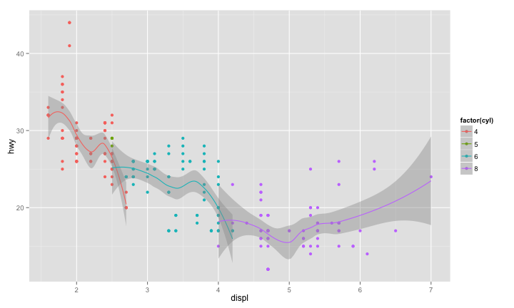
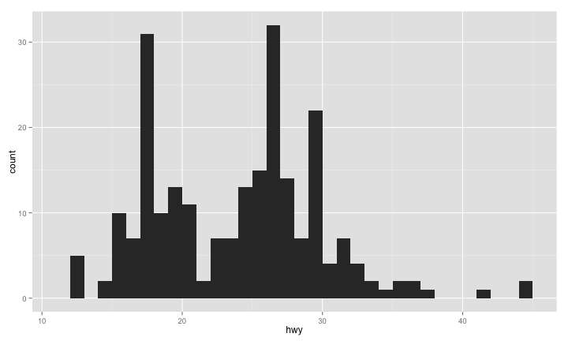
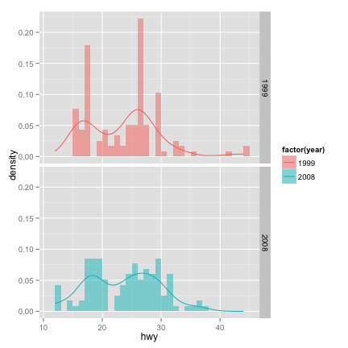
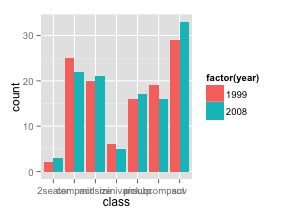
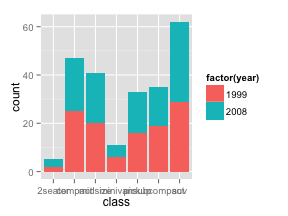
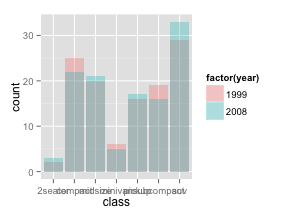
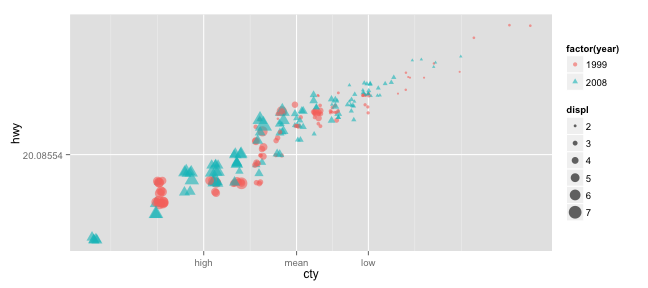
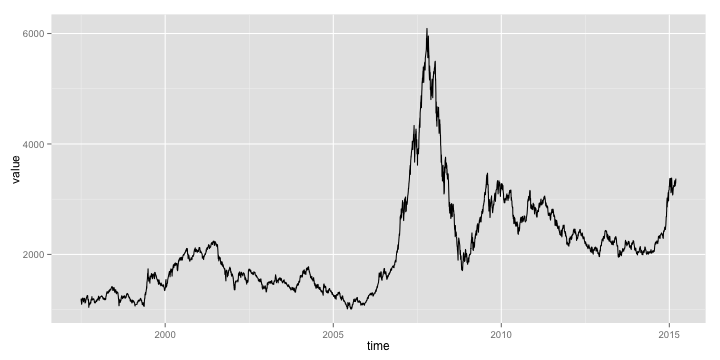

## R Plot System

- Basic Plot
- Lattice
- ggplot2
- googleVis
- rCharts
- ...

---

## Lattice


---

## ggplot2

- Layer
- Scale
- Coordinate
- Facet

---


```r
library(ggplot2)
p <- ggplot(data=mpg, aes(x=displ, y=hwy, colour=factor(cyl)))
p + geom_point() + geom_smooth(method=loess)
```



---


```r
library(ggplot2)
p <- ggplot(data=mpg, aes(x=displ, y=hwy))
p + geom_point(aes(colour=factor(cyl))) + geom_smooth(method=loess)
```


---

## Layer control

- The first layer must be orginal data layer
- data is the source, must be dataframe
- aes(aesthetic) controlls the map from variable to graph

---


```r
library(ggplot2)
p <- ggplot(data=mpg, aes(x=hwy))
p <- p + geom_histogram(binwidth=1)
print(p)
```



---


```r
library(ggplot2)
p <- ggplot(data=mpg, aes(hwy))
p + geom_histogram(binwidth=1, position='identity', alpha=0.5, 
aes(y=..density.., fill=factor(year))) + stat_density(geom='line',
position='identity', aes(colour=factor(year)))
```


---


```r
library(ggplot2)
p <- ggplot(data=mpg, aes(hwy))
p + geom_histogram(binwidth=1, position='identity', alpha=0.5, 
aes(y=..density.., fill=factor(year))) + stat_density(geom='line',
position='identity', aes(colour=factor(year))) + facet_grid(year~.)
```



---

## Position adjustment

Adjustment in one layer
- stack
- dodge
- fill
- identity
- jitter

---


```r
library(ggplot2)
p <- ggplot(data=mpg, aes(x=class, fill=factor(year)))
p + geom_bar(position='dodge'); p + geom_bar(position='stack')
p + geom_bar(position='fill'); p + geom_bar(position='identity',alpha=0.3)
```

<table>
<tr>
<td>

</td>
<td>

</td>
</tr>
<tr>
<td>

</td>
<td>

</td>
</tr>
</table>

---


```r
library(ggplot2); library(data.table); x=2001:2010
y=c(1.1,1.8,2.5,3.6,3.1,2.7,1.9,-0.1,-3.5,3.0); data=data.table(x,y)
p=ggplot(data,aes(x,y,fill=y))+geom_bar(stat="identity",position="identity")+
geom_abline(intercept=0,slope=0,size=1,colour='gray')+
geom_text(aes(label=y),hjust=0.5,vjust=-0.5)+scale_y_continuous(limits=c(-3.8,4.2))+
labs(x='Year',y='GDP increase rate %')+theme(plot.title=element_text("GDP"))
```


---

## Color and shape control


```r
library(ggplot2)
p <- ggplot(mpg, aes(cty, hwy))
p + geom_point(aes(colour = factor(year),shape = factor(year),
size = displ), alpha = 0.6, position = 'jitter')
```


---


```r
library(ggplot2)
cty.mean=with(mpg,mean(cty))
cty.sd=with(mpg,sd(cty))
p + geom_point(aes(colour = factor(year),shape = factor(year),
size = displ), 
alpha = 0.6, position = 'jitter') + scale_x_continuous(trans='log',
breaks=c(cty.mean-cty.sd,cty.mean,cty.mean+cty.sd), 
labels=c("high", "mean", "low")) + scale_y_continuous(trans='log')
```



---


```r
library(ggplot2)
p <- ggplot(mtcars, aes(x=wt, y=mpg,colour=factor(cyl),label=rownames(mtcars)))
p + geom_text(hjust=0,vjust=-1,alpha=0.8)+ geom_point(size=3,aes(shape=factor(cyl)))
```


---


```r
library(GGally)
ggpairs(USArrests)
```


---

## Time series


```r
library(quantmod); library(ggplot2)
SSEC <- getSymbols('^SSEC',src='yahoo',from = '1997-01-01', auto.assign=FALSE)
close <- (Cl(SSEC)); time <- index(close); value <- as.vector(close)
ggplot(data.frame(time,value),aes(time,value)) + geom_line()
```



---

## googleVis


---

## rCharts


---


