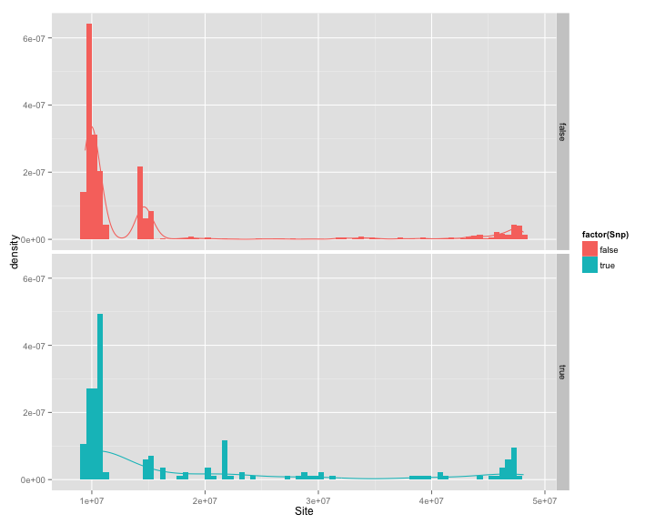
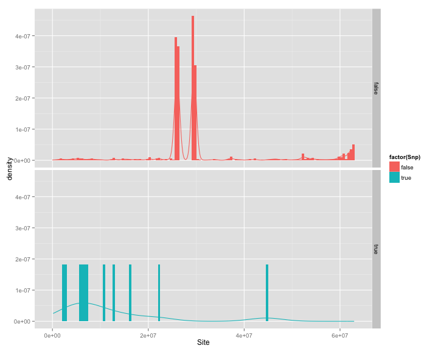
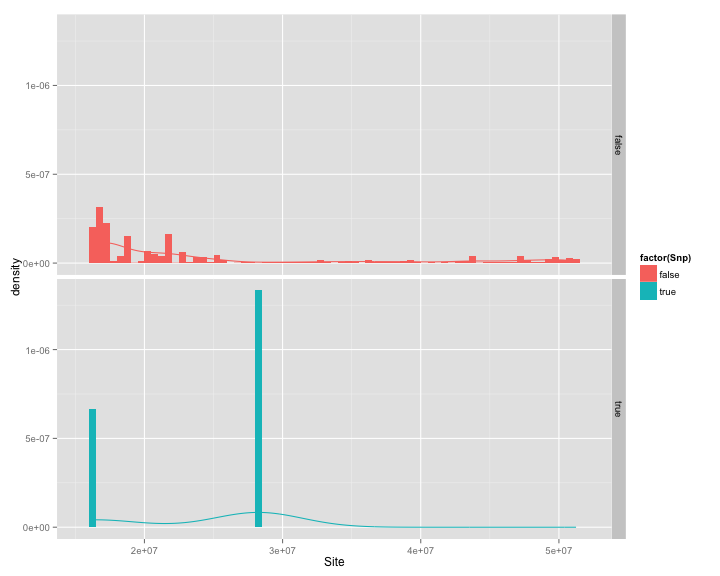

## 20150323 job

1. Quntile job
2. Improve the performance of C++ code

---

## Quntile Job

1. Data Classification: Chromosome, Dataset, Whole
2. Property Classification: Coverage, BQ, MQ
3. Quntile Classification: Same wide, Same count
4. Method Classification: TPR(to SNP), HM(to candidate set)

---

## GiaB Coverage SW TPR

26.33 50.56 275.03

| Software | FREEBAY | GATK    | SAMTOOL | MULTIGE | VARSCAN |
| -------- | ------- | ------- | ------- | ------- | ------- |
| Region 1 | 0.77287 | 0.68525 | 0.78289 | 0.54985 | 0.74705 |
| Region 2 | 0.96377 | 0.9314 | 0.98553 | 0.92962 | 0.98111 |
| Region 3 | 0.9695 | 0.93487 | 0.99472 | 0.98428 | 0.98166 |
| Region 4 | 0.4596 | 0.48485 | 0.44949 | 0.41414 | 0.52525 |

---

## GiaB Coverage SW HM

28.415 54.73 277.315

| Software | FREEBAY | GATK    | SAMTOOL | MULTIGE | VARSCAN |
| -------- | ------- | ------- | ------- | ------- | ------- |
| Region 1 | 0.34224 | 0.30395 | 0.28257 | 0.075947 | 0.33187 |
| Region 2 | 0.019219 | 0.01904 | 0.01813 | 0.0064678 | 0.019256 |
| Region 3 | 0.0085783 | 0.0091842 | 0.04801 | 0.016471 | 0.041903 |
| Region 4 | 0.052929 | 0.055902 | 0.05174 | 0.048766 | 0.06185 |

---

## GiaB Coverage SC TPR

46.5 50.9 55.1

| Software | FREEBAY | GATK    | SAMTOOL | MULTIGE | VARSCAN |
| -------- | ------- | ------- | ------- | ------- | ------- |
| Region 1 | 0.94096 | 0.91045 | 0.96492 | 0.88413 | 0.95967 |
| Region 2 | 0.97585 | 0.95581 | 0.99479 | 0.96196 | 0.9883 |
| Region 3 | 0.97916 | 0.9569 | 0.9916 | 0.96549 | 0.98634 |
| Region 4 | 0.95338 | 0.90025 | 0.99116 | 0.96291 | 0.9684 |

---

## GiaB Coverage SC HM

42.5 49.65 55.4

| Software | FREEBAY | GATK    | SAMTOOL | MULTIGE | VARSCAN |
| -------- | ------- | ------- | ------- | ------- | ------- |
| Region 1 | 0.51673 | 0.54251 | 0.52112 | 0.52527 | 0.51569 |
| Region 2 | 0.94927 | 0.91244 | 0.95335 | 0.91 | 0.96307 |
| Region 3 | 0.91737 | 0.89021 | 0.91063 | 0.88155 | 0.92748 |
| Region 4 | 0.84018 | 0.80281 | 0.85323 | 0.85263 | 0.84055 |

---

## GiaB BQ SW TPR

57.3 68.94 71.135

| Software | FREEBAY | GATK    | SAMTOOL | MULTIGE | VARSCAN |
| -------- | ------- | ------- | ------- | ------- | ------- |
| Region 1 | 0.35963 | 0.34339 | 0.43619 | 0.1949 | 0.44316 |
| Region 2 | 0.95714 | 0.92258 | 0.98381 | 0.92746 | 0.97719 |
| Region 3 | 0.97516 | 0.94105 | 0.99055 | 0.96318 | 0.97956 |
| Region 4 | 0.9628 | 0.92361 | 0.98413 | 0.91075 | 0.96436 |

---

## GiaB BQ SW HM

54.405 67.35 70.59

| Software | FREEBAY | GATK    | SAMTOOL | MULTIGE | VARSCAN |
| -------- | ------- | ------- | ------- | ------- | ------- |
| Region 1 | 0.0057342 | 0.013953 | 0.0050652 | 0.0043962 | 0.0047785 |
| Region 2 | 0.40707 | 0.39128 | 0.38095 | 0.17238 | 0.41085 |
| Region 3 | 0.092631 | 0.093926 | 0.11623 | 0.074501 | 0.1026 |
| Region 4 | 0.39357 | 0.38871 | 0.45207 | 0.34564 | 0.39371 |

---

## GiaB BQ SC TPR

68.15 69.34 70.22

| Software | FREEBAY | GATK    | SAMTOOL | MULTIGE | VARSCAN |
| -------- | ------- | ------- | ------- | ------- | ------- |
| Region 1 | 0.94674 | 0.90818 | 0.97692 | 0.89922 | 0.97079 |
| Region 2 | 0.97295 | 0.95068 | 0.99044 | 0.96162 | 0.98407 |
| Region 3 | 0.97568 | 0.94726 | 0.99037 | 0.96625 | 0.98086 |
| Region 4 | 0.97145 | 0.92937 | 0.98958 | 0.95275 | 0.97448 |

---

## GiaB BQ SC HM

66.01 68.79 70.06

| Software | FREEBAY | GATK    | SAMTOOL | MULTIGE | VARSCAN |
| -------- | ------- | ------- | ------- | ------- | ------- |
| Region 1 | 0.3581 | 0.37663 | 0.36414 | 0.36742 | 0.36322 |
| Region 2 | 0.89085 | 0.84573 | 0.87119 | 0.82986 | 0.91004 |
| Region 3 | 0.84937 | 0.82105 | 0.84157 | 0.82657 | 0.86227 |
| Region 4 | 0.85653 | 0.81914 | 0.86389 | 0.84759 | 0.87986 |

---

## GiaB MQ SW TPR

71.69 90.38 91.69

| Software | FREEBAY | GATK    | SAMTOOL | MULTIGE | VARSCAN |
| -------- | ------- | ------- | ------- | ------- | ------- |
| Region 1 | 0.80194 | 0.67649 | 0.84936 | 0.81686 | 0.80764 |
| Region 2 | 0.91494 | 0.84466 | 0.96082 | 0.83376 | 0.94986 |
| Region 3 | 0.9703 | 0.95302 | 0.9724 | 0.94654 | 0.97818 |
| Region 4 | 0.98513 | 0.97193 | 0.97539 | 0.97173 | 0.98289 |

---

## GiaB MQ SW HM

69.46 85.92 89.46

| Software | FREEBAY | GATK    | SAMTOOL | MULTIGE | VARSCAN |
| -------- | ------- | ------- | ------- | ------- | ------- |
| Region 1 | 0.048293 | 0.054121 | 0.047436 | 0.046798 | 0.043645 |
| Region 2 | 0.1809 | 0.19996 | 0.18388 | 0.18893 | 0.18494 |
| Region 3 | 0.21405 | 0.22559 | 0.22104 | 0.22175 | 0.21882 |
| Region 4 | 0.87441 | 0.85884 | 0.86439 | 0.85741 | 0.87435 |

---

## GiaB MQ SC TPR

90.8 92.3 92.6

| Software | FREEBAY | GATK    | SAMTOOL | MULTIGE | VARSCAN |
| -------- | ------- | ------- | ------- | ------- | ------- |
| Region 1 | 0.912 | 0.84883 | 0.95485 | 0.84459 | 0.94172 |
| Region 2 | 0.97598 | 0.95689 | 0.9671 | 0.95345 | 0.9773 |
| Region 3 | 0.98491 | 0.97193 | 0.97451 | 0.97188 | 0.98261 |
| Region 4 | 0.98991 | 0.98078 | 0.98227 | 0.98115 | 0.98774 |

---

## GiaB MQ SC HM

81.51 89.82 92.41

| Software | FREEBAY | GATK    | SAMTOOL | MULTIGE | VARSCAN |
| -------- | ------- | ------- | ------- | ------- | ------- |
| Region 1 | 0.31999 | 0.32993 | 0.31732 | 0.32478 | 0.31252 |
| Region 2 | 0.66466 | 0.69125 | 0.68694 | 0.69102 | 0.68103 |
| Region 3 | 0.77528 | 0.7563 | 0.76515 | 0.75078 | 0.77393 |
| Region 4 | 0.73292 | 0.72536 | 0.72553 | 0.72619 | 0.73152 |

---


## upenn Coverage SW TPR

10.653 19.17 229.435

| Software | FREEBAY | GATK    | SAMTOOL | MULTIGE | VARSCAN |
| -------- | ------- | ------- | ------- | ------- | ------- |
| Region 1 | 0.0035118 | 0.0039882 | 0.0036343 | 0.0034437 | 0.0035254 |
| Region 2 | 0.17723 | 0.19269 | 0.19128 | 0.18773 | 0.19106 |
| Region 3 | 0.14825 | 0.16259 | 0.16159 | 0.15885 | 0.16193 |
| Region 4 | 1.3702e-05 | 1.3702e-05 | 0 | 1.3702e-05 | 1.3702e-05 |

---

## upenn Coverage SW HM

10.891 19.75 257.725

| Software | FREEBAY | GATK    | SAMTOOL | MULTIGE | VARSCAN |
| -------- | ------- | ------- | ------- | ------- | ------- |
| Region 1 | 0.0046635 | 0.0052498 | 0.0048544 | 0.0046362 | 0.0047317 |
| Region 2 | 0.11677 | 0.10969 | 0.079622 | 0.079427 | 0.11267 |
| Region 3 | 0.10115 | 0.092337 | 0.10032 | 0.095957 | 0.097283 |
| Region 4 | 1.3695e-05 | 1.3695e-05 | 0 | 1.3695e-05 | 1.3695e-05 |

---

## upenn Coverage SC TPR

15.94 18.71 21.86

| Software | FREEBAY | GATK    | SAMTOOL | MULTIGE | VARSCAN |
| -------- | ------- | ------- | ------- | ------- | ------- |
| Region 1 | 0.54133 | 0.59209 | 0.5859 | 0.57328 | 0.58465 |
| Region 2 | 0.54081 | 0.58457 | 0.58075 | 0.57126 | 0.58009 |
| Region 3 | 0.51878 | 0.56741 | 0.56364 | 0.55455 | 0.56454 |
| Region 4 | 0.48324 | 0.53131 | 0.52808 | 0.51856 | 0.52946 |

---

## upenn Coverage SC HM

14.79 18.06 21.54

| Software | FREEBAY | GATK    | SAMTOOL | MULTIGE | VARSCAN |
| -------- | ------- | ------- | ------- | ------- | ------- |
| Region 1 | 0.063367 | 0.069162 | 0.068249 | 0.066803 | 0.06802 |
| Region 2 | 0.10664 | 0.11592 | 0.11514 | 0.11311 | 0.11504 |
| Region 3 | 0.10371 | 0.11313 | 0.11245 | 0.11055 | 0.11253 |
| Region 4 | 0.092384 | 0.10148 | 0.10084 | 0.099057 | 0.10115 |

---

## upenn BQ SW TPR

57.985 63.3 64.81

| Software | FREEBAY | GATK    | SAMTOOL | MULTIGE | VARSCAN |
| -------- | ------- | ------- | ------- | ------- | ------- |
| Region 1 | 9.5846e-05 | 0.00045184 | 9.5846e-05 | 0.00010954 | 0.00010954 |
| Region 2 | 0.15066 | 0.1643 | 0.16287 | 0.16018 | 0.16317 |
| Region 3 | 0.14038 | 0.1506 | 0.14982 | 0.14772 | 0.14981 |
| Region 4 | 0.06691 | 0.075969 | 0.075572 | 0.073214 | 0.07528 |

---

## upenn BQ SW HM

53.975 62.88 65.105

| Software | FREEBAY | GATK    | SAMTOOL | MULTIGE | VARSCAN |
| -------- | ------- | ------- | ------- | ------- | ------- |
| Region 1 | 0 | 1.914e-05 | 0 | 0 | 0 |
| Region 2 | 0.11141 | 0.1142 | 0.12074 | 0.11532 | 0.12099 |
| Region 3 | 0.14378 | 0.13164 | 0.13386 | 0.12832 | 0.14584 |
| Region 4 | 0.028706 | 0.032881 | 0.032677 | 0.031511 | 0.032501 |

---

## upenn BQ SC TPR

61.99 63.59 64.61

| Software | FREEBAY | GATK    | SAMTOOL | MULTIGE | VARSCAN |
| -------- | ------- | ------- | ------- | ------- | ------- |
| Region 1 | 0.46921 | 0.52134 | 0.51326 | 0.50398 | 0.51541 |
| Region 2 | 0.57598 | 0.61696 | 0.61375 | 0.60538 | 0.61387 |
| Region 3 | 0.57079 | 0.61007 | 0.60696 | 0.59911 | 0.60678 |
| Region 4 | 0.46805 | 0.52687 | 0.5243 | 0.50906 | 0.52257 |

---

## upenn BQ SC HM

61.51 63.14 64.53

| Software | FREEBAY | GATK    | SAMTOOL | MULTIGE | VARSCAN |
| -------- | ------- | ------- | ------- | ------- | ------- |
| Region 1 | 0.055837 | 0.063141 | 0.061548 | 0.060345 | 0.062008 |
| Region 2 | 0.11127 | 0.11994 | 0.11951 | 0.11774 | 0.11945 |
| Region 3 | 0.13112 | 0.13975 | 0.13906 | 0.13731 | 0.13903 |
| Region 4 | 0.097572 | 0.10941 | 0.10884 | 0.10581 | 0.10855 |

---

## upenn MQ SW TPR

73.135 91.52 92.205

| Software | FREEBAY | GATK    | SAMTOOL | MULTIGE | VARSCAN |
| -------- | ------- | ------- | ------- | ------- | ------- |
| Region 1 | 0.00078 | 0.00099895 | 0.00076631 | 0.00071158 | 0.00075263 |
| Region 2 | 0.10143 | 0.11104 | 0.10884 | 0.10761 | 0.10932 |
| Region 3 | 0.15105 | 0.16364 | 0.16308 | 0.15987 | 0.163 |
| Region 4 | 0.11001 | 0.12105 | 0.12091 | 0.11837 | 0.12062 |

---

## upenn MQ SW HM

70.4 87.8 90.4

| Software | FREEBAY | GATK    | SAMTOOL | MULTIGE | VARSCAN |
| -------- | ------- | ------- | ------- | ------- | ------- |
| Region 1 | 0.00033189 | 0.0004367 | 0.00034062 | 0.00029695 | 0.00031442 |
| Region 2 | 0.010179 | 0.011451 | 0.010551 | 0.010612 | 0.010742 |
| Region 3 | 0.021509 | 0.023633 | 0.023145 | 0.022913 | 0.02329 |
| Region 4 | 0.17596 | 0.16796 | 0.1554 | 0.16014 | 0.17465 |

---

## upenn MQ SC TPR

91.53 92.02 92.28

| Software | FREEBAY | GATK    | SAMTOOL | MULTIGE | VARSCAN |
| -------- | ------- | ------- | ------- | ------- | ------- |
| Region 1 | 0.55136 | 0.60353 | 0.59146 | 0.58458 | 0.59396 |
| Region 2 | 0.55147 | 0.59609 | 0.59367 | 0.58256 | 0.59337 |
| Region 3 | 0.51458 | 0.56004 | 0.55882 | 0.5474 | 0.55828 |
| Region 4 | 0.4669 | 0.51507 | 0.51453 | 0.50326 | 0.51329 |

---

## upenn MQ SC HM

86.29 91.14 92.05

| Software | FREEBAY | GATK    | SAMTOOL | MULTIGE | VARSCAN |
| -------- | ------- | ------- | ------- | ------- | ------- |
| Region 1 | 0.010477 | 0.0121 | 0.01084 | 0.010912 | 0.011057 |
| Region 2 | 0.074182 | 0.080706 | 0.079478 | 0.078673 | 0.079847 |
| Region 3 | 0.16512 | 0.17888 | 0.17807 | 0.17475 | 0.178 |
| Region 4 | 0.18375 | 0.20141 | 0.20111 | 0.19682 | 0.20075 |

---

## GiaB 18 Coverage SW TPR

26.62 51.14 272.27

| Software | FREEBAY | GATK    | SAMTOOL | MULTIGE | VARSCAN |
| -------- | ------- | ------- | ------- | ------- | ------- |
| Region 1 | 0.80186 | 0.70023 | 0.80046 | 0.55916 | 0.76195 |
| Region 2 | 0.96841 | 0.91796 | 0.98867 | 0.94047 | 0.98235 |
| Region 3 | 0.97693 | 0.94355 | 0.98939 | 0.97586 | 0.98396 |
| Region 4 | 0.66667 | 1 | 0.66667 | 1 | 1 |

---

## GiaB 18 Coverage SW HM

25.86 49.62 274.71

| Software | FREEBAY | GATK    | SAMTOOL | MULTIGE | VARSCAN |
| -------- | ------- | ------- | ------- | ------- | ------- |
| Region 1 | 0.50474 | 0.30551 | 0.53725 | 0.51107 | 0.55203 |
| Region 2 | 0.90191 | 0.74551 | 0.94874 | 0.92298 | 0.93847 |
| Region 3 | 0.9587 | 0.88797 | 0.97568 | 0.96901 | 0.96858 |
| Region 4 | 0.039604 | 0.014388 | 0.11765 | 0.018237 | 0.077922 |

---

## GiaB 18 Coverage SC TPR

47.8 52.1 55.9

| Software | FREEBAY | GATK    | SAMTOOL | MULTIGE | VARSCAN |
| -------- | ------- | ------- | ------- | ------- | ------- |
| Region 1 | 0.95135 | 0.89655 | 0.97297 | 0.89989 | 0.96578 |
| Region 2 | 0.97923 | 0.94782 | 0.99042 | 0.96359 | 0.98585 |
| Region 3 | 0.98215 | 0.94997 | 0.98511 | 0.96558 | 0.98598 |
| Region 4 | 0.96832 | 0.93122 | 0.99546 | 0.98177 | 0.98183 |

---

## GiaB 18 Coverage SC HM

44.5 50.8 55.4

| Software | FREEBAY | GATK    | SAMTOOL | MULTIGE | VARSCAN |
| -------- | ------- | ------- | ------- | ------- | ------- |
| Region 1 | 0.76986 | 0.54243 | 0.84612 | 0.81003 | 0.84474 |
| Region 2 | 0.95426 | 0.86693 | 0.97531 | 0.95976 | 0.96775 |
| Region 3 | 0.96817 | 0.90506 | 0.98101 | 0.97069 | 0.97622 |
| Region 4 | 0.94605 | 0.8645 | 0.96826 | 0.96379 | 0.95788 |

---

## GiaB 18 BQ SW TPR

57.56 69.46 71.225

| Software | FREEBAY | GATK    | SAMTOOL | MULTIGE | VARSCAN |
| -------- | ------- | ------- | ------- | ------- | ------- |
| Region 1 | 0.46575 | 0.36986 | 0.52055 | 0.24658 | 0.54795 |
| Region 2 | 0.96431 | 0.91141 | 0.98829 | 0.93938 | 0.97945 |
| Region 3 | 0.97985 | 0.9498 | 0.98702 | 0.96555 | 0.98136 |
| Region 4 | 0.97306 | 0.92947 | 0.98777 | 0.92469 | 0.9697 |

---

## GiaB 18 BQ SW HM

56.62 68.18 70.885

| Software | FREEBAY | GATK    | SAMTOOL | MULTIGE | VARSCAN |
| -------- | ------- | ------- | ------- | ------- | ------- |
| Region 1 | 0.06574 | 0.034156 | 0.19424 | 0.1691 | 0.2197 |
| Region 2 | 0.79211 | 0.53477 | 0.89396 | 0.8588 | 0.88258 |
| Region 3 | 0.96316 | 0.91545 | 0.97183 | 0.96236 | 0.96667 |
| Region 4 | 0.93955 | 0.85569 | 0.95578 | 0.94356 | 0.94813 |

---

## GiaB 18 BQ SC TPR

68.85 69.84 70.52

| Software | FREEBAY | GATK    | SAMTOOL | MULTIGE | VARSCAN |
| -------- | ------- | ------- | ------- | ------- | ------- |
| Region 1 | 0.95535 | 0.89215 | 0.98404 | 0.92202 | 0.97552 |
| Region 2 | 0.97944 | 0.95367 | 0.98804 | 0.96349 | 0.98399 |
| Region 3 | 0.9816 | 0.95212 | 0.98703 | 0.96711 | 0.98295 |
| Region 4 | 0.97644 | 0.94184 | 0.98843 | 0.95602 | 0.97678 |

---

## GiaB 18 BQ SC HM

67.46 69.48 70.4

| Software | FREEBAY | GATK    | SAMTOOL | MULTIGE | VARSCAN |
| -------- | ------- | ------- | ------- | ------- | ------- |
| Region 1 | 0.70487 | 0.41566 | 0.85489 | 0.80845 | 0.84095 |
| Region 2 | 0.95315 | 0.891 | 0.96326 | 0.95078 | 0.95922 |
| Region 3 | 0.96594 | 0.92241 | 0.97357 | 0.96521 | 0.96889 |
| Region 4 | 0.95459 | 0.89218 | 0.96721 | 0.95735 | 0.95946 |

---

## GiaB 18 MQ SW TPR

71.915 90.78 91.89

| Software | FREEBAY | GATK    | SAMTOOL | MULTIGE | VARSCAN |
| -------- | ------- | ------- | ------- | ------- | ------- |
| Region 1 | 0.85228 | 0.70489 | 0.88735 | 0.78954 | 0.84722 |
| Region 2 | 0.92356 | 0.84486 | 0.96952 | 0.8589 | 0.95915 |
| Region 3 | 0.97362 | 0.9485 | 0.96974 | 0.9463 | 0.97522 |
| Region 4 | 0.98569 | 0.97249 | 0.9763 | 0.97226 | 0.98299 |

---

## GiaB 18 MQ SW HM

70.29 87.53 90.265

| Software | FREEBAY | GATK    | SAMTOOL | MULTIGE | VARSCAN |
| -------- | ------- | ------- | ------- | ------- | ------- |
| Region 1 | 0.59014 | 0.39484 | 0.64049 | 0.60867 | 0.62998 |
| Region 2 | 0.6205 | 0.34391 | 0.78338 | 0.72192 | 0.7563 |
| Region 3 | 0.91003 | 0.73803 | 0.94201 | 0.91405 | 0.93236 |
| Region 4 | 0.98397 | 0.96606 | 0.987 | 0.9821 | 0.98364 |

---

## GiaB 18 MQ SC TPR

91.63 92.48 92.68

| Software | FREEBAY | GATK    | SAMTOOL | MULTIGE | VARSCAN |
| -------- | ------- | ------- | ------- | ------- | ------- |
| Region 1 | 0.93245 | 0.85724 | 0.96883 | 0.87506 | 0.95443 |
| Region 2 | 0.97996 | 0.96113 | 0.96962 | 0.96071 | 0.97759 |
| Region 3 | 0.98629 | 0.97315 | 0.97572 | 0.97282 | 0.98276 |
| Region 4 | 0.98996 | 0.98164 | 0.98301 | 0.9808 | 0.9876 |

---

## GiaB 18 MQ SC HM

84.5 91.95 92.6

| Software | FREEBAY | GATK    | SAMTOOL | MULTIGE | VARSCAN |
| -------- | ------- | ------- | ------- | ------- | ------- |
| Region 1 | 0.55959 | 0.31509 | 0.70272 | 0.64884 | 0.68232 |
| Region 2 | 0.91646 | 0.75415 | 0.94802 | 0.92357 | 0.93738 |
| Region 3 | 0.98514 | 0.97329 | 0.9875 | 0.98361 | 0.98554 |
| Region 4 | 0.99068 | 0.987 | 0.99192 | 0.98942 | 0.98844 |

---

## GiaB 19 Coverage SW TPR

25.355 48.61 148.655

| Software | FREEBAY | GATK    | SAMTOOL | MULTIGE | VARSCAN |
| -------- | ------- | ------- | ------- | ------- | ------- |
| Region 1 | 0.74909 | 0.66424 | 0.76485 | 0.47273 | 0.73394 |
| Region 2 | 0.95528 | 0.91543 | 0.97961 | 0.90847 | 0.97671 |
| Region 3 | 0.97245 | 0.9397 | 0.99336 | 0.96121 | 0.98336 |
| Region 4 | 0.5283 | 0.28302 | 0.73585 | 0.43396 | 0.5283 |

---

## GiaB 19 Coverage SW HM

24.175 46.25 272.925

| Software | FREEBAY | GATK    | SAMTOOL | MULTIGE | VARSCAN |
| -------- | ------- | ------- | ------- | ------- | ------- |
| Region 1 | 0.36681 | 0.18614 | 0.401 | 0.3959 | 0.44534 |
| Region 2 | 0.81963 | 0.59426 | 0.9104 | 0.8731 | 0.90305 |
| Region 3 | 0.91689 | 0.79745 | 0.94816 | 0.93378 | 0.942 |
| Region 4 | 0 | 0 | 0 | 0 | 0 |

---

## GiaB 19 Coverage SC TPR

44.7 49.2 53.4

| Software | FREEBAY | GATK    | SAMTOOL | MULTIGE | VARSCAN |
| -------- | ------- | ------- | ------- | ------- | ------- |
| Region 1 | 0.93076 | 0.89018 | 0.95483 | 0.83712 | 0.95262 |
| Region 2 | 0.96989 | 0.94599 | 0.99279 | 0.94898 | 0.98728 |
| Region 3 | 0.97375 | 0.95209 | 0.99223 | 0.95246 | 0.98661 |
| Region 4 | 0.96907 | 0.92237 | 0.99258 | 0.96216 | 0.97845 |

---

## GiaB 19 Coverage SC HM

39.5 47 52.6

| Software | FREEBAY | GATK    | SAMTOOL | MULTIGE | VARSCAN |
| -------- | ------- | ------- | ------- | ------- | ------- |
| Region 1 | 0.59715 | 0.34129 | 0.71384 | 0.67592 | 0.73643 |
| Region 2 | 0.89626 | 0.7279 | 0.949 | 0.92351 | 0.94219 |
| Region 3 | 0.94098 | 0.83231 | 0.96795 | 0.9497 | 0.96347 |
| Region 4 | 0.88828 | 0.75895 | 0.92448 | 0.91385 | 0.91567 |

---

## GiaB 19 BQ SW TPR

57.08 68.34 70.835

| Software | FREEBAY | GATK    | SAMTOOL | MULTIGE | VARSCAN |
| -------- | ------- | ------- | ------- | ------- | ------- |
| Region 1 | 0.30882 | 0.29412 | 0.44853 | 0.13235 | 0.40441 |
| Region 2 | 0.95313 | 0.9132 | 0.98016 | 0.90948 | 0.97612 |
| Region 3 | 0.96977 | 0.94336 | 0.98506 | 0.94422 | 0.97865 |
| Region 4 | 0.96638 | 0.92356 | 0.97977 | 0.87654 | 0.96454 |

---

## GiaB 19 BQ SW HM

53.83 66.2 69.925

| Software | FREEBAY | GATK    | SAMTOOL | MULTIGE | VARSCAN |
| -------- | ------- | ------- | ------- | ------- | ------- |
| Region 1 | 0.032432 | 0.024029 | 0.054795 | 0.026622 | 0.071066 |
| Region 2 | 0.61784 | 0.31417 | 0.8291 | 0.77549 | 0.81832 |
| Region 3 | 0.93215 | 0.85605 | 0.94556 | 0.93013 | 0.94529 |
| Region 4 | 0.89379 | 0.78821 | 0.90819 | 0.89376 | 0.90306 |

---

## GiaB 19 BQ SC TPR

67.47 68.72 69.69

| Software | FREEBAY | GATK    | SAMTOOL | MULTIGE | VARSCAN |
| -------- | ------- | ------- | ------- | ------- | ------- |
| Region 1 | 0.94118 | 0.8957 | 0.97009 | 0.87336 | 0.96719 |
| Region 2 | 0.96841 | 0.94219 | 0.98212 | 0.94022 | 0.983 |
| Region 3 | 0.96882 | 0.94729 | 0.98262 | 0.94434 | 0.98022 |
| Region 4 | 0.96931 | 0.93255 | 0.98384 | 0.93346 | 0.97261 |

---

## GiaB 19 BQ SC HM

63.78 67.81 69.39

| Software | FREEBAY | GATK    | SAMTOOL | MULTIGE | VARSCAN |
| -------- | ------- | ------- | ------- | ------- | ------- |
| Region 1 | 0.34733 | 0.13049 | 0.64754 | 0.57478 | 0.63698 |
| Region 2 | 0.88017 | 0.72817 | 0.92435 | 0.89852 | 0.92416 |
| Region 3 | 0.9395 | 0.87278 | 0.9509 | 0.93627 | 0.95064 |
| Region 4 | 0.90764 | 0.81446 | 0.92012 | 0.90676 | 0.91611 |

---

## GiaB 19 MQ SW TPR

71.435 89.83 91.415

| Software | FREEBAY | GATK    | SAMTOOL | MULTIGE | VARSCAN |
| -------- | ------- | ------- | ------- | ------- | ------- |
| Region 1 | 0.80645 | 0.6696 | 0.83822 | 0.68231 | 0.81085 |
| Region 2 | 0.91805 | 0.86385 | 0.9599 | 0.81657 | 0.95379 |
| Region 3 | 0.96692 | 0.9595 | 0.97217 | 0.95349 | 0.97908 |
| Region 4 | 0.9836 | 0.97014 | 0.97355 | 0.97259 | 0.98242 |

---

## GiaB 19 MQ SW HM

69.35 85.7 89.35

| Software | FREEBAY | GATK    | SAMTOOL | MULTIGE | VARSCAN |
| -------- | ------- | ------- | ------- | ------- | ------- |
| Region 1 | 0.4743 | 0.30216 | 0.51384 | 0.50673 | 0.52875 |
| Region 2 | 0.50914 | 0.25778 | 0.71338 | 0.62367 | 0.699 |
| Region 3 | 0.83896 | 0.6048 | 0.89363 | 0.87149 | 0.89064 |
| Region 4 | 0.96802 | 0.93439 | 0.97311 | 0.97036 | 0.97203 |

---

## GiaB 19 MQ SC TPR

89.52 91.83 92.43

| Software | FREEBAY | GATK    | SAMTOOL | MULTIGE | VARSCAN |
| -------- | ------- | ------- | ------- | ------- | ------- |
| Region 1 | 0.90485 | 0.84767 | 0.94905 | 0.79452 | 0.94162 |
| Region 2 | 0.96928 | 0.95977 | 0.97168 | 0.95195 | 0.97879 |
| Region 3 | 0.98004 | 0.96577 | 0.96957 | 0.96668 | 0.97921 |
| Region 4 | 0.98874 | 0.97735 | 0.97888 | 0.98373 | 0.98717 |

---

## GiaB 19 MQ SC HM

81.58 88.35 92

| Software | FREEBAY | GATK    | SAMTOOL | MULTIGE | VARSCAN |
| -------- | ------- | ------- | ------- | ------- | ------- |
| Region 1 | 0.44377 | 0.23704 | 0.60522 | 0.53774 | 0.60328 |
| Region 2 | 0.71334 | 0.41795 | 0.84061 | 0.78843 | 0.83091 |
| Region 3 | 0.94082 | 0.85265 | 0.95348 | 0.94676 | 0.95233 |
| Region 4 | 0.9799 | 0.97326 | 0.98198 | 0.98182 | 0.98113 |

---

## GiaB 20 Coverage SW TPR

26.54 50.98 266.09

| Software | FREEBAY | GATK    | SAMTOOL | MULTIGE | VARSCAN |
| -------- | ------- | ------- | ------- | ------- | ------- |
| Region 1 | 0.76568 | 0.65911 | 0.78685 | 0.50869 | 0.75359 |
| Region 2 | 0.96778 | 0.93937 | 0.98714 | 0.93805 | 0.98211 |
| Region 3 | 0.95157 | 0.90951 | 0.99117 | 0.99177 | 0.96983 |
| Region 4 | 0.22449 | 0.22449 | 0.2449 | 0.18367 | 0.22449 |

---

## GiaB 20 Coverage SW HM

28.66 55.22 277.46

| Software | FREEBAY | GATK    | SAMTOOL | MULTIGE | VARSCAN |
| -------- | ------- | ------- | ------- | ------- | ------- |
| Region 1 | 0.42358 | 0.22462 | 0.48029 | 0.45882 | 0.51588 |
| Region 2 | 0.92475 | 0.79339 | 0.96339 | 0.94514 | 0.95578 |
| Region 3 | 0.84565 | 0.70653 | 0.89773 | 0.91868 | 0.8687 |
| Region 4 | 0.035503 | 0.046838 | 0.046316 | 0.033573 | 0.036419 |

---

## GiaB 20 Coverage SC TPR

47 51.3 55.4

| Software | FREEBAY | GATK    | SAMTOOL | MULTIGE | VARSCAN |
| -------- | ------- | ------- | ------- | ------- | ------- |
| Region 1 | 0.9487 | 0.91923 | 0.96982 | 0.88775 | 0.96405 |
| Region 2 | 0.97727 | 0.96403 | 0.9955 | 0.96998 | 0.98872 |
| Region 3 | 0.98007 | 0.9635 | 0.99396 | 0.97261 | 0.98695 |
| Region 4 | 0.92173 | 0.85528 | 0.98847 | 0.98905 | 0.95533 |

---

## GiaB 20 Coverage SC HM

43.9 50.4 56.1

| Software | FREEBAY | GATK    | SAMTOOL | MULTIGE | VARSCAN |
| -------- | ------- | ------- | ------- | ------- | ------- |
| Region 1 | 0.72744 | 0.47254 | 0.82493 | 0.7892 | 0.82846 |
| Region 2 | 0.94647 | 0.84221 | 0.97239 | 0.95746 | 0.96616 |
| Region 3 | 0.95795 | 0.88093 | 0.97723 | 0.96735 | 0.9719 |
| Region 4 | 0.81264 | 0.65819 | 0.87287 | 0.88367 | 0.8372 |

---

## GiaB 20 BQ SW TPR

57.885 68.96 70.83

| Software | FREEBAY | GATK    | SAMTOOL | MULTIGE | VARSCAN |
| -------- | ------- | ------- | ------- | ------- | ------- |
| Region 1 | 0.31429 | 0.31429 | 0.35714 | 0.23571 | 0.37857 |
| Region 2 | 0.95915 | 0.92326 | 0.98474 | 0.93474 | 0.97856 |
| Region 3 | 0.97673 | 0.94506 | 0.99279 | 0.99058 | 0.98073 |
| Region 4 | 0.94094 | 0.89271 | 0.98887 | 0.96691 | 0.96186 |

---

## GiaB 20 BQ SW HM

55.175 67.43 70.5

| Software | FREEBAY | GATK    | SAMTOOL | MULTIGE | VARSCAN |
| -------- | ------- | ------- | ------- | ------- | ------- |
| Region 1 | 0.040632 | 0.033478 | 0.06747 | 0.048889 | 0.074534 |
| Region 2 | 0.72463 | 0.44061 | 0.86915 | 0.82841 | 0.85433 |
| Region 3 | 0.9366 | 0.86372 | 0.9524 | 0.94775 | 0.94356 |
| Region 4 | 0.86615 | 0.74751 | 0.90485 | 0.90024 | 0.88188 |

---

## GiaB 20 BQ SC TPR

68.24 69.34 70.15

| Software | FREEBAY | GATK    | SAMTOOL | MULTIGE | VARSCAN |
| -------- | ------- | ------- | ------- | ------- | ------- |
| Region 1 | 0.94718 | 0.90658 | 0.97563 | 0.90213 | 0.96982 |
| Region 2 | 0.97605 | 0.95474 | 0.99373 | 0.98199 | 0.98726 |
| Region 3 | 0.97887 | 0.94963 | 0.9933 | 0.99034 | 0.98302 |
| Region 4 | 0.96017 | 0.92251 | 0.99114 | 0.9895 | 0.97243 |

---

## GiaB 20 BQ SC HM

66.28 68.89 70.05

| Software | FREEBAY | GATK    | SAMTOOL | MULTIGE | VARSCAN |
| -------- | ------- | ------- | ------- | ------- | ------- |
| Region 1 | 0.57154 | 0.28552 | 0.78786 | 0.73566 | 0.77345 |
| Region 2 | 0.92956 | 0.83604 | 0.94953 | 0.93521 | 0.94344 |
| Region 3 | 0.93998 | 0.87366 | 0.95499 | 0.95164 | 0.94575 |
| Region 4 | 0.89424 | 0.79314 | 0.92269 | 0.92165 | 0.90384 |

---

## GiaB 20 MQ SW TPR

72.3 90.88 91.94

| Software | FREEBAY | GATK    | SAMTOOL | MULTIGE | VARSCAN |
| -------- | ------- | ------- | ------- | ------- | ------- |
| Region 1 | 0.79135 | 0.58447 | 0.85062 | 0.77712 | 0.80202 |
| Region 2 | 0.90547 | 0.82172 | 0.95933 | 0.90981 | 0.93793 |
| Region 3 | 0.97043 | 0.95152 | 0.96848 | 0.94761 | 0.97585 |
| Region 4 | 0.98623 | 0.9742 | 0.9761 | 0.97347 | 0.98364 |

---

## GiaB 20 MQ SW HM

69.715 86.43 89.715

| Software | FREEBAY | GATK    | SAMTOOL | MULTIGE | VARSCAN |
| -------- | ------- | ------- | ------- | ------- | ------- |
| Region 1 | 0.4301 | 0.25358 | 0.48064 | 0.45748 | 0.4686 |
| Region 2 | 0.40649 | 0.207 | 0.5834 | 0.55066 | 0.52932 |
| Region 3 | 0.83407 | 0.59593 | 0.88917 | 0.88629 | 0.88011 |
| Region 4 | 0.98216 | 0.9593 | 0.98566 | 0.98075 | 0.98324 |

---

## GiaB 20 MQ SC TPR

91.39 92.37 92.61

| Software | FREEBAY | GATK    | SAMTOOL | MULTIGE | VARSCAN |
| -------- | ------- | ------- | ------- | ------- | ------- |
| Region 1 | 0.908 | 0.82869 | 0.95702 | 0.89024 | 0.93968 |
| Region 2 | 0.9792 | 0.96214 | 0.969 | 0.96047 | 0.97871 |
| Region 3 | 0.98531 | 0.97292 | 0.97481 | 0.97221 | 0.98224 |
| Region 4 | 0.99024 | 0.98146 | 0.98235 | 0.98089 | 0.98833 |

---

## GiaB 20 MQ SC HM

82.13 90.46 92.46

| Software | FREEBAY | GATK    | SAMTOOL | MULTIGE | VARSCAN |
| -------- | ------- | ------- | ------- | ------- | ------- |
| Region 1 | 0.34821 | 0.18329 | 0.48582 | 0.44252 | 0.44371 |
| Region 2 | 0.7564 | 0.49341 | 0.8509 | 0.85136 | 0.83011 |
| Region 3 | 0.97795 | 0.94855 | 0.98236 | 0.97623 | 0.97935 |
| Region 4 | 0.99034 | 0.98657 | 0.99169 | 0.98867 | 0.98982 |

---

## GiaB 21 Coverage SW TPR

27.796 53.37 276.435

| Software | FREEBAY | GATK    | SAMTOOL | MULTIGE | VARSCAN |
| -------- | ------- | ------- | ------- | ------- | ------- |
| Region 1 | 0.78504 | 0.74337 | 0.80587 | 0.62311 | 0.77462 |
| Region 2 | 0.96993 | 0.9571 | 0.99101 | 0.94732 | 0.98561 |
| Region 3 | 0.96051 | 0.90075 | 0.98667 | 0.94157 | 0.9602 |
| Region 4 | 0.52 | 0.54 | 0.49333 | 0.54 | 0.60667 |

---

## GiaB 21 Coverage SW HM

41.615 81.13 290.515

| Software | FREEBAY | GATK    | SAMTOOL | MULTIGE | VARSCAN |
| -------- | ------- | ------- | ------- | ------- | ------- |
| Region 1 | 0.59539 | 0.38484 | 0.69442 | 0.68979 | 0.71601 |
| Region 2 | 0.9293 | 0.83663 | 0.95432 | 0.94526 | 0.94526 |
| Region 3 | 0.18857 | 0.12968 | 0.22293 | 0.18753 | 0.1929 |
| Region 4 | 0.052356 | 0.040882 | 0.052423 | 0.043808 | 0.061751 |

---

## GiaB 21 Coverage SC TPR

47.5 51.9 56.1

| Software | FREEBAY | GATK    | SAMTOOL | MULTIGE | VARSCAN |
| -------- | ------- | ------- | ------- | ------- | ------- |
| Region 1 | 0.94775 | 0.94657 | 0.97139 | 0.90409 | 0.96872 |
| Region 2 | 0.97701 | 0.96879 | 0.99627 | 0.96734 | 0.98945 |
| Region 3 | 0.9797 | 0.96846 | 0.99296 | 0.9677 | 0.98542 |
| Region 4 | 0.94119 | 0.83613 | 0.97494 | 0.76506 | 0.93431 |

---

## GiaB 21 Coverage SC HM

45.3 52.7 62.8

| Software | FREEBAY | GATK    | SAMTOOL | MULTIGE | VARSCAN |
| -------- | ------- | ------- | ------- | ------- | ------- |
| Region 1 | 0.70903 | 0.49821 | 0.79396 | 0.78211 | 0.80445 |
| Region 2 | 0.94481 | 0.85589 | 0.96576 | 0.95211 | 0.95938 |
| Region 3 | 0.94994 | 0.87871 | 0.96811 | 0.96092 | 0.96068 |
| Region 4 | 0.27484 | 0.17783 | 0.31156 | 0.26024 | 0.28188 |

---

## GiaB 21 BQ SW TPR

59.06 69.29 71.01

| Software | FREEBAY | GATK    | SAMTOOL | MULTIGE | VARSCAN |
| -------- | ------- | ------- | ------- | ------- | ------- |
| Region 1 | 0.56522 | 0.52174 | 0.65217 | 0.34783 | 0.73913 |
| Region 2 | 0.95721 | 0.91624 | 0.98438 | 0.9115 | 0.97655 |
| Region 3 | 0.96765 | 0.91659 | 0.98771 | 0.91517 | 0.97435 |
| Region 4 | 0.96447 | 0.93155 | 0.98206 | 0.86762 | 0.96586 |

---

## GiaB 21 BQ SW HM

55.475 68.2 70.825

| Software | FREEBAY | GATK    | SAMTOOL | MULTIGE | VARSCAN |
| -------- | ------- | ------- | ------- | ------- | ------- |
| Region 1 | 0.042636 | 0.018975 | 0.097778 | 0.080645 | 0.12987 |
| Region 2 | 0.72847 | 0.49149 | 0.81755 | 0.78438 | 0.80108 |
| Region 3 | 0.84839 | 0.7389 | 0.87301 | 0.84915 | 0.86106 |
| Region 4 | 0.81378 | 0.68884 | 0.84422 | 0.80869 | 0.83547 |

---

## GiaB 21 BQ SC TPR

68.56 69.72 70.49

| Software | FREEBAY | GATK    | SAMTOOL | MULTIGE | VARSCAN |
| -------- | ------- | ------- | ------- | ------- | ------- |
| Region 1 | 0.95026 | 0.90971 | 0.98059 | 0.89079 | 0.97411 |
| Region 2 | 0.96974 | 0.93739 | 0.98803 | 0.94335 | 0.97993 |
| Region 3 | 0.96619 | 0.9178 | 0.98784 | 0.92196 | 0.97308 |
| Region 4 | 0.96757 | 0.9188 | 0.98613 | 0.88563 | 0.97225 |

---

## GiaB 21 BQ SC HM

67.46 69.42 70.42

| Software | FREEBAY | GATK    | SAMTOOL | MULTIGE | VARSCAN |
| -------- | ------- | ------- | ------- | ------- | ------- |
| Region 1 | 0.65732 | 0.39639 | 0.78109 | 0.74383 | 0.76559 |
| Region 2 | 0.85175 | 0.73969 | 0.87417 | 0.85524 | 0.8654 |
| Region 3 | 0.85082 | 0.74319 | 0.87515 | 0.85147 | 0.86171 |
| Region 4 | 0.82336 | 0.70245 | 0.85347 | 0.81814 | 0.84134 |

---

## GiaB 21 MQ SW TPR

71.78 90.32 91.66

| Software | FREEBAY | GATK    | SAMTOOL | MULTIGE | VARSCAN |
| -------- | ------- | ------- | ------- | ------- | ------- |
| Region 1 | 0.76019 | 0.66037 | 0.8293 | 0.84347 | 0.79268 |
| Region 2 | 0.90647 | 0.77961 | 0.95246 | 0.6378 | 0.93 |
| Region 3 | 0.96554 | 0.93626 | 0.96845 | 0.92056 | 0.97832 |
| Region 4 | 0.98406 | 0.96864 | 0.97347 | 0.96737 | 0.98205 |

---

## GiaB 21 MQ SW HM

68.59 84.18 88.59

| Software | FREEBAY | GATK    | SAMTOOL | MULTIGE | VARSCAN |
| -------- | ------- | ------- | ------- | ------- | ------- |
| Region 1 | 0.27257 | 0.18967 | 0.33438 | 0.37117 | 0.32348 |
| Region 2 | 0.32266 | 0.18497 | 0.40435 | 0.3401 | 0.37341 |
| Region 3 | 0.66226 | 0.43895 | 0.71662 | 0.66677 | 0.70251 |
| Region 4 | 0.97002 | 0.93324 | 0.97431 | 0.96739 | 0.97317 |

---

## GiaB 21 MQ SC TPR

90.95 92.39 92.65

| Software | FREEBAY | GATK    | SAMTOOL | MULTIGE | VARSCAN |
| -------- | ------- | ------- | ------- | ------- | ------- |
| Region 1 | 0.90031 | 0.80322 | 0.94562 | 0.70101 | 0.92612 |
| Region 2 | 0.97402 | 0.94603 | 0.96118 | 0.94153 | 0.97511 |
| Region 3 | 0.98442 | 0.97044 | 0.97406 | 0.97032 | 0.98277 |
| Region 4 | 0.98994 | 0.98227 | 0.98321 | 0.98064 | 0.98755 |

---

## GiaB 21 MQ SC HM

78.26 87.53 92.39

| Software | FREEBAY | GATK    | SAMTOOL | MULTIGE | VARSCAN |
| -------- | ------- | ------- | ------- | ------- | ------- |
| Region 1 | 0.28018 | 0.17591 | 0.34512 | 0.32535 | 0.32198 |
| Region 2 | 0.46271 | 0.26997 | 0.55098 | 0.47553 | 0.52477 |
| Region 3 | 0.93265 | 0.84548 | 0.94266 | 0.92808 | 0.94287 |
| Region 4 | 0.98899 | 0.98319 | 0.99062 | 0.98886 | 0.9882 |

---

## GiaB 22 Coverage SW TPR

25.4555 48.8 214.35

| Software | FREEBAY | GATK    | SAMTOOL | MULTIGE | VARSCAN |
| -------- | ------- | ------- | ------- | ------- | ------- |
| Region 1 | 0.74774 | 0.68323 | 0.74516 | 0.64774 | 0.70839 |
| Region 2 | 0.95714 | 0.95587 | 0.98073 | 0.92221 | 0.97784 |
| Region 3 | 0.97407 | 0.97155 | 0.99279 | 0.99179 | 0.98331 |
| Region 4 | 0 | 0 | 0.5 | 0.5 | 0 |

---

## GiaB 22 Coverage SW HM

24.09 46.08 272.79

| Software | FREEBAY | GATK    | SAMTOOL | MULTIGE | VARSCAN |
| -------- | ------- | ------- | ------- | ------- | ------- |
| Region 1 | 0.39064 | 0.25298 | 0.41507 | 0.45481 | 0.4462 |
| Region 2 | 0.79982 | 0.59928 | 0.87915 | 0.85416 | 0.87 |
| Region 3 | 0.90631 | 0.79621 | 0.94157 | 0.93776 | 0.93239 |
| Region 4 | 0 | 0.032787 | 0 | 0 | 0 |

---

## GiaB 22 Coverage SC TPR

45.1 49.5 53.9

| Software | FREEBAY | GATK    | SAMTOOL | MULTIGE | VARSCAN |
| -------- | ------- | ------- | ------- | ------- | ------- |
| Region 1 | 0.92164 | 0.91459 | 0.94717 | 0.87045 | 0.93964 |
| Region 2 | 0.97441 | 0.97559 | 0.99499 | 0.9628 | 0.99006 |
| Region 3 | 0.97801 | 0.97978 | 0.99532 | 0.97028 | 0.98962 |
| Region 4 | 0.96858 | 0.9554 | 0.9871 | 0.99094 | 0.97077 |

---

## GiaB 22 Coverage SC HM

39.9 47.6 53.4

| Software | FREEBAY | GATK    | SAMTOOL | MULTIGE | VARSCAN |
| -------- | ------- | ------- | ------- | ------- | ------- |
| Region 1 | 0.5574 | 0.35781 | 0.64142 | 0.64946 | 0.66445 |
| Region 2 | 0.89562 | 0.7547 | 0.93991 | 0.92062 | 0.93173 |
| Region 3 | 0.936 | 0.84296 | 0.96067 | 0.94853 | 0.95669 |
| Region 4 | 0.86478 | 0.73705 | 0.91326 | 0.92263 | 0.89728 |

---

## GiaB 22 BQ SW TPR

58.33 68.4 70.7

| Software | FREEBAY | GATK    | SAMTOOL | MULTIGE | VARSCAN |
| -------- | ------- | ------- | ------- | ------- | ------- |
| Region 1 | 0.52525 | 0.46465 | 0.55556 | 0.46465 | 0.60606 |
| Region 2 | 0.95161 | 0.95112 | 0.9809 | 0.93737 | 0.97348 |
| Region 3 | 0.97167 | 0.97332 | 0.98569 | 0.97897 | 0.97935 |
| Region 4 | 0.95096 | 0.94897 | 0.97117 | 0.945 | 0.9493 |

---

## GiaB 22 BQ SW HM

54.145 66.72 70.275

| Software | FREEBAY | GATK    | SAMTOOL | MULTIGE | VARSCAN |
| -------- | ------- | ------- | ------- | ------- | ------- |
| Region 1 | 0.028571 | 0.02445 | 0.060606 | 0.054422 | 0.06 |
| Region 2 | 0.66205 | 0.38279 | 0.82621 | 0.79302 | 0.81159 |
| Region 3 | 0.90899 | 0.84158 | 0.92607 | 0.92577 | 0.92521 |
| Region 4 | 0.82816 | 0.7053 | 0.86055 | 0.87002 | 0.85801 |

---

## GiaB 22 BQ SC TPR

67.58 68.74 69.66

| Software | FREEBAY | GATK    | SAMTOOL | MULTIGE | VARSCAN |
| -------- | ------- | ------- | ------- | ------- | ------- |
| Region 1 | 0.94146 | 0.93712 | 0.97333 | 0.90389 | 0.96514 |
| Region 2 | 0.96806 | 0.97362 | 0.98668 | 0.9755 | 0.98219 |
| Region 3 | 0.97196 | 0.9725 | 0.98564 | 0.97481 | 0.98087 |
| Region 4 | 0.96683 | 0.96924 | 0.98227 | 0.97616 | 0.97045 |

---

## GiaB 22 BQ SC HM

65.03 68.12 69.48

| Software | FREEBAY | GATK    | SAMTOOL | MULTIGE | VARSCAN |
| -------- | ------- | ------- | ------- | ------- | ------- |
| Region 1 | 0.46162 | 0.20647 | 0.71098 | 0.66771 | 0.69023 |
| Region 2 | 0.8845 | 0.77911 | 0.9142 | 0.90304 | 0.9123 |
| Region 3 | 0.91593 | 0.85534 | 0.93042 | 0.92994 | 0.93007 |
| Region 4 | 0.8712 | 0.77756 | 0.89509 | 0.90263 | 0.89327 |

---

## GiaB 22 MQ SW TPR

71.345 89.69 91.345

| Software | FREEBAY | GATK    | SAMTOOL | MULTIGE | VARSCAN |
| -------- | ------- | ------- | ------- | ------- | ------- |
| Region 1 | 0.76976 | 0.68707 | 0.79169 | 0.8095 | 0.74418 |
| Region 2 | 0.9096 | 0.89599 | 0.95408 | 0.85569 | 0.94627 |
| Region 3 | 0.96895 | 0.96882 | 0.97899 | 0.95396 | 0.981 |
| Region 4 | 0.98506 | 0.97493 | 0.97711 | 0.97239 | 0.98454 |

---

## GiaB 22 MQ SW HM

68.915 84.83 88.915

| Software | FREEBAY | GATK    | SAMTOOL | MULTIGE | VARSCAN |
| -------- | ------- | ------- | ------- | ------- | ------- |
| Region 1 | 0.42985 | 0.32536 | 0.46759 | 0.50831 | 0.46694 |
| Region 2 | 0.4304 | 0.22919 | 0.60155 | 0.5781 | 0.5821 |
| Region 3 | 0.79038 | 0.53492 | 0.87326 | 0.84394 | 0.86132 |
| Region 4 | 0.96578 | 0.93274 | 0.97112 | 0.96783 | 0.97005 |

---

## GiaB 22 MQ SC TPR

90.15 92.09 92.48

| Software | FREEBAY | GATK    | SAMTOOL | MULTIGE | VARSCAN |
| -------- | ------- | ------- | ------- | ------- | ------- |
| Region 1 | 0.89783 | 0.88439 | 0.93969 | 0.89999 | 0.92673 |
| Region 2 | 0.97308 | 0.96422 | 0.971 | 0.95589 | 0.98026 |
| Region 3 | 0.98388 | 0.97005 | 0.97253 | 0.9687 | 0.98126 |
| Region 4 | 0.99197 | 0.98605 | 0.98605 | 0.98401 | 0.99136 |

---

## GiaB 22 MQ SC HM

80.18 88.68 92.2

| Software | FREEBAY | GATK    | SAMTOOL | MULTIGE | VARSCAN |
| -------- | ------- | ------- | ------- | ------- | ------- |
| Region 1 | 0.40727 | 0.25688 | 0.4971 | 0.51274 | 0.49286 |
| Region 2 | 0.66145 | 0.38724 | 0.80995 | 0.77455 | 0.79121 |
| Region 3 | 0.9494 | 0.88299 | 0.96132 | 0.95496 | 0.95886 |
| Region 4 | 0.97772 | 0.97171 | 0.9784 | 0.97719 | 0.9782 |

---

## upenn 19 Coverage SW TPR

11.238 20.34 230.02

| Software | FREEBAY | GATK    | SAMTOOL | MULTIGE | VARSCAN |
| -------- | ------- | ------- | ------- | ------- | ------- |
| Region 1 | 0.69714 | 0.66286 | 0.80571 | 0.56571 | 0.8 |
| Region 2 | 0.71601 | 0.71187 | 0.53215 | 0.44316 | 0.63884 |
| Region 3 | 0.63478 | 0.62058 | 0.44889 | 0.38119 | 0.59465 |
| Region 4 | 0 | 0 | 0.42857 | 0.28571 | 0.42857 |

---

## upenn 19 Coverage SW HM

10.366 18.7 257.05

| Software | FREEBAY | GATK    | SAMTOOL | MULTIGE | VARSCAN |
| -------- | ------- | ------- | ------- | ------- | ------- |
| Region 1 | 0.020277 | 0.0078018 | 0.016732 | 0.018215 | 0.020613 |
| Region 2 | 0.13332 | 0.05962 | 0.085954 | 0.11142 | 0.091259 |
| Region 3 | 0.16617 | 0.090621 | 0.10586 | 0.13089 | 0.10901 |
| Region 4 | 0.046512 | 0.063492 | 0.19355 | 0.040816 | 0.13889 |

---

## upenn 19 Coverage SC TPR

16.91 19.82 22.68

| Software | FREEBAY | GATK    | SAMTOOL | MULTIGE | VARSCAN |
| -------- | ------- | ------- | ------- | ------- | ------- |
| Region 1 | 0.71185 | 0.72718 | 0.63938 | 0.47885 | 0.7393 |
| Region 2 | 0.71749 | 0.70419 | 0.49483 | 0.4133 | 0.66749 |
| Region 3 | 0.67076 | 0.6629 | 0.46428 | 0.39897 | 0.62436 |
| Region 4 | 0.61519 | 0.58797 | 0.44296 | 0.38357 | 0.56199 |

---

## upenn 19 Coverage SC HM

15.03 18.29 21.38

| Software | FREEBAY | GATK    | SAMTOOL | MULTIGE | VARSCAN |
| -------- | ------- | ------- | ------- | ------- | ------- |
| Region 1 | 0.089407 | 0.035718 | 0.066259 | 0.082508 | 0.073663 |
| Region 2 | 0.14672 | 0.069173 | 0.090523 | 0.11937 | 0.095664 |
| Region 3 | 0.152 | 0.078361 | 0.090279 | 0.11792 | 0.094334 |
| Region 4 | 0.17736 | 0.10032 | 0.11926 | 0.14087 | 0.12132 |

---

## upenn 19 BQ SW TPR

57.9 63.13 64.7

| Software | FREEBAY | GATK    | SAMTOOL | MULTIGE | VARSCAN |
| -------- | ------- | ------- | ------- | ------- | ------- |
| Region 1 | 0.24324 | 0.18919 | 0.32432 | 0.27027 | 0.32432 |
| Region 2 | 0.66314 | 0.68324 | 0.54933 | 0.40777 | 0.67748 |
| Region 3 | 0.73767 | 0.72912 | 0.55494 | 0.46126 | 0.67729 |
| Region 4 | 0.61529 | 0.60239 | 0.35601 | 0.3157 | 0.48146 |

---

## upenn 19 BQ SW HM

53.865 62.66 64.83

| Software | FREEBAY | GATK    | SAMTOOL | MULTIGE | VARSCAN |
| -------- | ------- | ------- | ------- | ------- | ------- |
| Region 1 | 0 | 0.008016 | 0.04878 | 0 | 0 |
| Region 2 | 0.12228 | 0.059413 | 0.086175 | 0.1054 | 0.090469 |
| Region 3 | 0.16044 | 0.084058 | 0.10609 | 0.12978 | 0.11084 |
| Region 4 | 0.16901 | 0.076483 | 0.087536 | 0.12774 | 0.09367 |

---

## upenn 19 BQ SC TPR

61.82 63.36 64.48

| Software | FREEBAY | GATK    | SAMTOOL | MULTIGE | VARSCAN |
| -------- | ------- | ------- | ------- | ------- | ------- |
| Region 1 | 0.59569 | 0.62936 | 0.51721 | 0.36469 | 0.6566 |
| Region 2 | 0.74186 | 0.7421 | 0.60103 | 0.46853 | 0.71712 |
| Region 3 | 0.74883 | 0.73918 | 0.56836 | 0.47787 | 0.69567 |
| Region 4 | 0.62846 | 0.61734 | 0.37154 | 0.3414 | 0.50025 |

---

## upenn 19 BQ SC HM

61.3 62.85 64.36

| Software | FREEBAY | GATK    | SAMTOOL | MULTIGE | VARSCAN |
| -------- | ------- | ------- | ------- | ------- | ------- |
| Region 1 | 0.0929 | 0.043389 | 0.071896 | 0.086329 | 0.075758 |
| Region 2 | 0.14435 | 0.076621 | 0.098193 | 0.11936 | 0.10244 |
| Region 3 | 0.15715 | 0.083966 | 0.10857 | 0.12924 | 0.11328 |
| Region 4 | 0.17119 | 0.080636 | 0.093533 | 0.13071 | 0.099363 |

---

## upenn 19 MQ SW TPR

73.18 91.26 92.06

| Software | FREEBAY | GATK    | SAMTOOL | MULTIGE | VARSCAN |
| -------- | ------- | ------- | ------- | ------- | ------- |
| Region 1 | 0.71053 | 0.52632 | 0.76316 | 0.52632 | 0.68421 |
| Region 2 | 0.68823 | 0.68925 | 0.53923 | 0.42078 | 0.65436 |
| Region 3 | 0.71291 | 0.7094 | 0.4709 | 0.46628 | 0.56882 |
| Region 4 | 0.64635 | 0.65804 | 0.42208 | 0.39488 | 0.55044 |

---

## upenn 19 MQ SW HM

70.46 87.85 90.425

| Software | FREEBAY | GATK    | SAMTOOL | MULTIGE | VARSCAN |
| -------- | ------- | ------- | ------- | ------- | ------- |
| Region 1 | 0.0073109 | 0.0028564 | 0.0050385 | 0.0050096 | 0.0054182 |
| Region 2 | 0.036832 | 0.013838 | 0.030284 | 0.031711 | 0.031545 |
| Region 3 | 0.091049 | 0.043088 | 0.055576 | 0.070824 | 0.058563 |
| Region 4 | 0.19552 | 0.11072 | 0.11957 | 0.1584 | 0.12599 |

---

## upenn 19 MQ SC TPR

91.29 91.95 92.26

| Software | FREEBAY | GATK    | SAMTOOL | MULTIGE | VARSCAN |
| -------- | ------- | ------- | ------- | ------- | ------- |
| Region 1 | 0.69111 | 0.69456 | 0.55722 | 0.42186 | 0.67364 |
| Region 2 | 0.70924 | 0.70401 | 0.47274 | 0.46652 | 0.56311 |
| Region 3 | 0.69212 | 0.69648 | 0.46521 | 0.44315 | 0.57794 |
| Region 4 | 0.62238 | 0.63883 | 0.3993 | 0.36765 | 0.53564 |

---

## upenn 19 MQ SC HM

86.18 90.74 91.92

| Software | FREEBAY | GATK    | SAMTOOL | MULTIGE | VARSCAN |
| -------- | ------- | ------- | ------- | ------- | ------- |
| Region 1 | 0.02508 | 0.0097561 | 0.021709 | 0.022698 | 0.023313 |
| Region 2 | 0.087763 | 0.040561 | 0.054276 | 0.068411 | 0.057081 |
| Region 3 | 0.1588 | 0.085555 | 0.093555 | 0.12617 | 0.099119 |
| Region 4 | 0.24161 | 0.14277 | 0.15072 | 0.19777 | 0.15797 |

---

## upenn 20 Coverage SW TPR

11.8385 18.81 121.105

| Software | FREEBAY | GATK    | SAMTOOL | MULTIGE | VARSCAN |
| -------- | ------- | ------- | ------- | ------- | ------- |
| Region 1 | 0.72184 | 0.74483 | 0.84138 | 0.64828 | 0.85977 |
| Region 2 | 0.71841 | 0.71649 | 0.56886 | 0.50794 | 0.62135 |
| Region 3 | 0.70243 | 0.67757 | 0.52168 | 0.51496 | 0.6029 |
| Region 4 | 0 | 0 | 1 | 0 | 1 |

---

## upenn 20 Coverage SW HM

10.392 18.75 218.725

| Software | FREEBAY | GATK    | SAMTOOL | MULTIGE | VARSCAN |
| -------- | ------- | ------- | ------- | ------- | ------- |
| Region 1 | 0.025953 | 0.0099868 | 0.022724 | 0.028809 | 0.029056 |
| Region 2 | 0.2366 | 0.11741 | 0.15128 | 0.20863 | 0.16126 |
| Region 3 | 0.23359 | 0.12531 | 0.14696 | 0.19521 | 0.14857 |
| Region 4 | 0 | 0.016807 | 0.090909 | 0.021739 | 0.032258 |

---

## upenn 20 Coverage SC TPR

15.91 18.38 21.32

| Software | FREEBAY | GATK    | SAMTOOL | MULTIGE | VARSCAN |
| -------- | ------- | ------- | ------- | ------- | ------- |
| Region 1 | 0.72465 | 0.73683 | 0.66731 | 0.54942 | 0.69982 |
| Region 2 | 0.71659 | 0.71272 | 0.53438 | 0.47853 | 0.65171 |
| Region 3 | 0.71563 | 0.70715 | 0.51864 | 0.46039 | 0.64042 |
| Region 4 | 0.68754 | 0.6491 | 0.51521 | 0.50881 | 0.61851 |

---

## upenn 20 Coverage SC HM

14.97 17.91 21.18

| Software | FREEBAY | GATK    | SAMTOOL | MULTIGE | VARSCAN |
| -------- | ------- | ------- | ------- | ------- | ------- |
| Region 1 | 0.17809 | 0.079328 | 0.12408 | 0.16806 | 0.13796 |
| Region 2 | 0.25398 | 0.13075 | 0.15907 | 0.21973 | 0.16791 |
| Region 3 | 0.2509 | 0.13315 | 0.15032 | 0.20687 | 0.15623 |
| Region 4 | 0.22223 | 0.12034 | 0.14633 | 0.1899 | 0.14509 |

---

## upenn 20 BQ SW TPR

59.055 63.38 64.815

| Software | FREEBAY | GATK    | SAMTOOL | MULTIGE | VARSCAN |
| -------- | ------- | ------- | ------- | ------- | ------- |
| Region 1 | 0.33333 | 0.30769 | 0.4359 | 0.33333 | 0.46154 |
| Region 2 | 0.70976 | 0.71449 | 0.59479 | 0.51517 | 0.60727 |
| Region 3 | 0.76082 | 0.74483 | 0.61651 | 0.58944 | 0.63508 |
| Region 4 | 0.62776 | 0.61491 | 0.45259 | 0.40117 | 0.43411 |

---

## upenn 20 BQ SW HM

54.765 63 64.91

| Software | FREEBAY | GATK    | SAMTOOL | MULTIGE | VARSCAN |
| -------- | ------- | ------- | ------- | ------- | ------- |
| Region 1 | 0 | 0.0037244 | 0 | 0 | 0 |
| Region 2 | 0.20648 | 0.099852 | 0.13625 | 0.17898 | 0.14201 |
| Region 3 | 0.24344 | 0.13611 | 0.16419 | 0.21376 | 0.16983 |
| Region 4 | 0.24788 | 0.11566 | 0.13144 | 0.20803 | 0.14017 |

---

## upenn 20 BQ SC TPR

62.11 63.7 64.66

| Software | FREEBAY | GATK    | SAMTOOL | MULTIGE | VARSCAN |
| -------- | ------- | ------- | ------- | ------- | ------- |
| Region 1 | 0.67056 | 0.69503 | 0.58212 | 0.4569 | 0.5874 |
| Region 2 | 0.76309 | 0.74767 | 0.6558 | 0.60922 | 0.67122 |
| Region 3 | 0.77071 | 0.75373 | 0.6241 | 0.59638 | 0.63676 |
| Region 4 | 0.63989 | 0.62878 | 0.45782 | 0.41693 | 0.45557 |

---

## upenn 20 BQ SC HM

61.63 63.31 64.61

| Software | FREEBAY | GATK    | SAMTOOL | MULTIGE | VARSCAN |
| -------- | ------- | ------- | ------- | ------- | ------- |
| Region 1 | 0.17904 | 0.079089 | 0.11747 | 0.15697 | 0.12316 |
| Region 2 | 0.22592 | 0.12347 | 0.15472 | 0.19704 | 0.16017 |
| Region 3 | 0.24712 | 0.13925 | 0.16955 | 0.21714 | 0.17477 |
| Region 4 | 0.24867 | 0.12189 | 0.13857 | 0.21084 | 0.14692 |

---

## upenn 20 MQ SW TPR

78.125 91.69 92.29

| Software | FREEBAY | GATK    | SAMTOOL | MULTIGE | VARSCAN |
| -------- | ------- | ------- | ------- | ------- | ------- |
| Region 1 | 0.78571 | 0.64286 | 0.71429 | 0.75 | 0.71429 |
| Region 2 | 0.73539 | 0.71868 | 0.60701 | 0.54223 | 0.59104 |
| Region 3 | 0.71436 | 0.71486 | 0.52152 | 0.51062 | 0.54922 |
| Region 4 | 0.67818 | 0.6846 | 0.49285 | 0.47069 | 0.49687 |

---

## upenn 20 MQ SW HM

70.955 88.66 90.83

| Software | FREEBAY | GATK    | SAMTOOL | MULTIGE | VARSCAN |
| -------- | ------- | ------- | ------- | ------- | ------- |
| Region 1 | 0.0028225 | 0.0013607 | 0.0023692 | 0.0041189 | 0.0029756 |
| Region 2 | 0.046634 | 0.016213 | 0.03931 | 0.047025 | 0.036901 |
| Region 3 | 0.15105 | 0.068127 | 0.086465 | 0.11893 | 0.092772 |
| Region 4 | 0.28603 | 0.1658 | 0.17394 | 0.23986 | 0.18372 |

---

## upenn 20 MQ SC TPR

91.64 92.04 92.29

| Software | FREEBAY | GATK    | SAMTOOL | MULTIGE | VARSCAN |
| -------- | ------- | ------- | ------- | ------- | ------- |
| Region 1 | 0.73442 | 0.71285 | 0.64382 | 0.56903 | 0.60722 |
| Region 2 | 0.73136 | 0.72696 | 0.53549 | 0.51921 | 0.55389 |
| Region 3 | 0.70071 | 0.70531 | 0.5134 | 0.50119 | 0.53719 |
| Region 4 | 0.67818 | 0.6846 | 0.49285 | 0.47069 | 0.49687 |

---

## upenn 20 MQ SC HM

88.07 91.51 92.14

| Software | FREEBAY | GATK    | SAMTOOL | MULTIGE | VARSCAN |
| -------- | ------- | ------- | ------- | ------- | ------- |
| Region 1 | 0.032641 | 0.01187 | 0.029052 | 0.035042 | 0.02756 |
| Region 2 | 0.18094 | 0.086422 | 0.10407 | 0.14457 | 0.1111 |
| Region 3 | 0.29276 | 0.17144 | 0.17978 | 0.24738 | 0.19049 |
| Region 4 | 0.30815 | 0.18247 | 0.1879 | 0.25762 | 0.19717 |

---

## upenn 21 Coverage SW TPR

10.215 17.51 81.055

| Software | FREEBAY | GATK    | SAMTOOL | MULTIGE | VARSCAN |
| -------- | ------- | ------- | ------- | ------- | ------- |
| Region 1 | 0.76636 | 0.72897 | 0.86916 | 0.79439 | 0.8785 |
| Region 2 | 0.73416 | 0.72986 | 0.59613 | 0.52511 | 0.64393 |
| Region 3 | 0.72349 | 0.67219 | 0.46494 | 0.38877 | 0.53972 |
| Region 4 | 0.5 | 0.5 | 0 | 0 | 0.66667 |

---

## upenn 21 Coverage SW HM

12.896 23.76 259.73

| Software | FREEBAY | GATK    | SAMTOOL | MULTIGE | VARSCAN |
| -------- | ------- | ------- | ------- | ------- | ------- |
| Region 1 | 0.11821 | 0.055764 | 0.08778 | 0.1194 | 0.1012 |
| Region 2 | 0.22017 | 0.1159 | 0.13589 | 0.18438 | 0.14318 |
| Region 3 | 0.10508 | 0.040935 | 0.071299 | 0.082112 | 0.065202 |
| Region 4 | 0 | 0 | 0 | 0 | 0 |

---

## upenn 21 Coverage SC TPR

14.47 16.79 19.89

| Software | FREEBAY | GATK    | SAMTOOL | MULTIGE | VARSCAN |
| -------- | ------- | ------- | ------- | ------- | ------- |
| Region 1 | 0.73043 | 0.75712 | 0.69835 | 0.6048 | 0.75652 |
| Region 2 | 0.73673 | 0.72924 | 0.55322 | 0.50345 | 0.65847 |
| Region 3 | 0.73477 | 0.72372 | 0.51195 | 0.43847 | 0.66577 |
| Region 4 | 0.71707 | 0.61836 | 0.42124 | 0.30573 | 0.48155 |

---

## upenn 21 Coverage SC HM

13.89 17.11 21.79

| Software | FREEBAY | GATK    | SAMTOOL | MULTIGE | VARSCAN |
| -------- | ------- | ------- | ------- | ------- | ------- |
| Region 1 | 0.14576 | 0.071212 | 0.10488 | 0.1433 | 0.11841 |
| Region 2 | 0.22987 | 0.12192 | 0.14602 | 0.19995 | 0.1558 |
| Region 3 | 0.21885 | 0.11347 | 0.12915 | 0.17605 | 0.13463 |
| Region 4 | 0.13484 | 0.057533 | 0.088218 | 0.1051 | 0.08353 |

---

## upenn 21 BQ SW TPR

60.515 63.44 64.845

| Software | FREEBAY | GATK    | SAMTOOL | MULTIGE | VARSCAN |
| -------- | ------- | ------- | ------- | ------- | ------- |
| Region 1 | 0.57239 | 0.58249 | 0.67677 | 0.43434 | 0.60269 |
| Region 2 | 0.73841 | 0.71685 | 0.57995 | 0.48599 | 0.59378 |
| Region 3 | 0.78154 | 0.73806 | 0.58866 | 0.50682 | 0.61125 |
| Region 4 | 0.64235 | 0.58262 | 0.39914 | 0.47067 | 0.40701 |

---

## upenn 21 BQ SW HM

55.55 63.18 65.16

| Software | FREEBAY | GATK    | SAMTOOL | MULTIGE | VARSCAN |
| -------- | ------- | ------- | ------- | ------- | ------- |
| Region 1 | 0 | 0 | 0 | 0 | 0 |
| Region 2 | 0.17465 | 0.082884 | 0.11528 | 0.15025 | 0.11954 |
| Region 3 | 0.19591 | 0.10272 | 0.1293 | 0.167 | 0.13388 |
| Region 4 | 0.19161 | 0.083445 | 0.10248 | 0.1585 | 0.1126 |

---

## upenn 21 BQ SC TPR

62.16 63.77 64.72

| Software | FREEBAY | GATK    | SAMTOOL | MULTIGE | VARSCAN |
| -------- | ------- | ------- | ------- | ------- | ------- |
| Region 1 | 0.69754 | 0.68945 | 0.57524 | 0.44844 | 0.55516 |
| Region 2 | 0.77678 | 0.74617 | 0.62766 | 0.52355 | 0.65737 |
| Region 3 | 0.7861 | 0.73847 | 0.59527 | 0.51618 | 0.60875 |
| Region 4 | 0.65879 | 0.60167 | 0.41776 | 0.47428 | 0.42673 |

---

## upenn 21 BQ SC HM

61.84 63.55 64.71

| Software | FREEBAY | GATK    | SAMTOOL | MULTIGE | VARSCAN |
| -------- | ------- | ------- | ------- | ------- | ------- |
| Region 1 | 0.16624 | 0.073476 | 0.10797 | 0.14282 | 0.11224 |
| Region 2 | 0.18296 | 0.095065 | 0.12505 | 0.15791 | 0.12899 |
| Region 3 | 0.19877 | 0.10488 | 0.13461 | 0.16981 | 0.1385 |
| Region 4 | 0.1936 | 0.092302 | 0.1112 | 0.1622 | 0.11943 |

---

## upenn 21 MQ SW TPR

73.265 91.53 92.175

| Software | FREEBAY | GATK    | SAMTOOL | MULTIGE | VARSCAN |
| -------- | ------- | ------- | ------- | ------- | ------- |
| Region 1 | 0.6 | 0.5 | 0.65 | 0.55 | 0.65 |
| Region 2 | 0.7369 | 0.65244 | 0.59741 | 0.49117 | 0.50294 |
| Region 3 | 0.74392 | 0.73611 | 0.53345 | 0.52955 | 0.57693 |
| Region 4 | 0.70607 | 0.71003 | 0.52292 | 0.48895 | 0.51966 |

---

## upenn 21 MQ SW HM

69.91 86.82 89.91

| Software | FREEBAY | GATK    | SAMTOOL | MULTIGE | VARSCAN |
| -------- | ------- | ------- | ------- | ------- | ------- |
| Region 1 | 0.0030876 | 0.0015813 | 0.0024102 | 0.0030127 | 0.0022711 |
| Region 2 | 0.02362 | 0.0076144 | 0.018032 | 0.019245 | 0.016216 |
| Region 3 | 0.11681 | 0.047741 | 0.06956 | 0.092336 | 0.073652 |
| Region 4 | 0.24423 | 0.14018 | 0.14904 | 0.20494 | 0.15898 |

---

## upenn 21 MQ SC TPR

91.51 91.97 92.25

| Software | FREEBAY | GATK    | SAMTOOL | MULTIGE | VARSCAN |
| -------- | ------- | ------- | ------- | ------- | ------- |
| Region 1 | 0.73678 | 0.67127 | 0.63251 | 0.48978 | 0.53425 |
| Region 2 | 0.74081 | 0.73086 | 0.55455 | 0.54671 | 0.57806 |
| Region 3 | 0.74022 | 0.73468 | 0.50817 | 0.50963 | 0.57385 |
| Region 4 | 0.70101 | 0.70682 | 0.53195 | 0.48731 | 0.50718 |

---

## upenn 21 MQ SC HM

84.04 91.03 92

| Software | FREEBAY | GATK    | SAMTOOL | MULTIGE | VARSCAN |
| -------- | ------- | ------- | ------- | ------- | ------- |
| Region 1 | 0.0099084 | 0.0036334 | 0.0081447 | 0.0090481 | 0.0075737 |
| Region 2 | 0.12121 | 0.051111 | 0.07337 | 0.097374 | 0.077119 |
| Region 3 | 0.22849 | 0.13336 | 0.14169 | 0.19477 | 0.15187 |
| Region 4 | 0.28588 | 0.16678 | 0.17279 | 0.23774 | 0.18318 |

---

## upenn 22 Coverage SW TPR

11.185 20.13 82.465

| Software | FREEBAY | GATK    | SAMTOOL | MULTIGE | VARSCAN |
| -------- | ------- | ------- | ------- | ------- | ------- |
| Region 1 | 0.71429 | 0.77679 | 0.8125 | 0.79464 | 0.86607 |
| Region 2 | 0.71678 | 0.7155 | 0.5916 | 0.45953 | 0.62205 |
| Region 3 | 0.67975 | 0.6665 | 0.52077 | 0.44782 | 0.5983 |
| Region 4 | 0.16667 | 0.16667 | 1 | 0 | 0.5 |

---

## upenn 22 Coverage SW HM

10.4115 18.79 195.245

| Software | FREEBAY | GATK    | SAMTOOL | MULTIGE | VARSCAN |
| -------- | ------- | ------- | ------- | ------- | ------- |
| Region 1 | 0.015731 | 0.0072933 | 0.013075 | 0.01824 | 0.018208 |
| Region 2 | 0.18556 | 0.083654 | 0.11749 | 0.15911 | 0.1248 |
| Region 3 | 0.20464 | 0.10897 | 0.1261 | 0.16134 | 0.12887 |
| Region 4 | 0 | 0 | 0 | 0 | 0 |

---

## upenn 22 Coverage SC TPR

17.03 20.03 22.91

| Software | FREEBAY | GATK    | SAMTOOL | MULTIGE | VARSCAN |
| -------- | ------- | ------- | ------- | ------- | ------- |
| Region 1 | 0.72463 | 0.76516 | 0.68251 | 0.52904 | 0.75782 |
| Region 2 | 0.7098 | 0.69507 | 0.5599 | 0.43113 | 0.64894 |
| Region 3 | 0.68251 | 0.67766 | 0.54252 | 0.43097 | 0.62334 |
| Region 4 | 0.67649 | 0.65439 | 0.50224 | 0.45131 | 0.59001 |

---

## upenn 22 Coverage SC HM

15.26 18.86 22.14

| Software | FREEBAY | GATK    | SAMTOOL | MULTIGE | VARSCAN |
| -------- | ------- | ------- | ------- | ------- | ------- |
| Region 1 | 0.11781 | 0.048742 | 0.08465 | 0.11744 | 0.096808 |
| Region 2 | 0.2039 | 0.098686 | 0.12473 | 0.16835 | 0.13072 |
| Region 3 | 0.19658 | 0.10324 | 0.11736 | 0.15436 | 0.12162 |
| Region 4 | 0.21252 | 0.11488 | 0.13524 | 0.16802 | 0.13624 |

---

## upenn 22 BQ SW TPR

59.725 63.2 64.76

| Software | FREEBAY | GATK    | SAMTOOL | MULTIGE | VARSCAN |
| -------- | ------- | ------- | ------- | ------- | ------- |
| Region 1 | 0.45 | 0.5 | 0.6875 | 0.5875 | 0.7625 |
| Region 2 | 0.70182 | 0.7168 | 0.58261 | 0.44578 | 0.63534 |
| Region 3 | 0.754 | 0.7524 | 0.60964 | 0.50548 | 0.64596 |
| Region 4 | 0.59522 | 0.61657 | 0.38728 | 0.35226 | 0.43424 |

---

## upenn 22 BQ SW HM

54.8 62.75 65.04

| Software | FREEBAY | GATK    | SAMTOOL | MULTIGE | VARSCAN |
| -------- | ------- | ------- | ------- | ------- | ------- |
| Region 1 | 0 | 0 | 0 | 0 | 0 |
| Region 2 | 0.16137 | 0.076626 | 0.10676 | 0.13756 | 0.11139 |
| Region 3 | 0.20486 | 0.10792 | 0.13204 | 0.16969 | 0.13803 |
| Region 4 | 0.21143 | 0.096313 | 0.1098 | 0.17185 | 0.11846 |

---

## upenn 22 BQ SC TPR

61.84 63.43 64.54

| Software | FREEBAY | GATK    | SAMTOOL | MULTIGE | VARSCAN |
| -------- | ------- | ------- | ------- | ------- | ------- |
| Region 1 | 0.63494 | 0.67788 | 0.56026 | 0.41731 | 0.61442 |
| Region 2 | 0.77388 | 0.77324 | 0.63332 | 0.53844 | 0.69444 |
| Region 3 | 0.76738 | 0.76386 | 0.62095 | 0.53124 | 0.6687 |
| Region 4 | 0.61795 | 0.63558 | 0.42372 | 0.38077 | 0.45449 |

---

## upenn 22 BQ SC HM

61.39 62.92 64.43

| Software | FREEBAY | GATK    | SAMTOOL | MULTIGE | VARSCAN |
| -------- | ------- | ------- | ------- | ------- | ------- |
| Region 1 | 0.13372 | 0.059911 | 0.093345 | 0.12151 | 0.098137 |
| Region 2 | 0.18162 | 0.094188 | 0.11874 | 0.15001 | 0.1231 |
| Region 3 | 0.20261 | 0.10949 | 0.13808 | 0.17011 | 0.14346 |
| Region 4 | 0.21362 | 0.10279 | 0.11785 | 0.17204 | 0.12566 |

---

## upenn 22 MQ SW TPR

73.13 91.51 92.18

| Software | FREEBAY | GATK    | SAMTOOL | MULTIGE | VARSCAN |
| -------- | ------- | ------- | ------- | ------- | ------- |
| Region 1 | 0.75 | 0.55556 | 0.66667 | 0.72222 | 0.58333 |
| Region 2 | 0.73151 | 0.73046 | 0.6176 | 0.46933 | 0.61374 |
| Region 3 | 0.71192 | 0.70611 | 0.56654 | 0.49631 | 0.55558 |
| Region 4 | 0.66797 | 0.67678 | 0.51184 | 0.44257 | 0.52827 |

---

## upenn 22 MQ SW HM

70.225 87.45 90.205

| Software | FREEBAY | GATK    | SAMTOOL | MULTIGE | VARSCAN |
| -------- | ------- | ------- | ------- | ------- | ------- |
| Region 1 | 0.0086885 | 0.0037486 | 0.0061162 | 0.0086412 | 0.0070154 |
| Region 2 | 0.038162 | 0.012354 | 0.029967 | 0.034989 | 0.030711 |
| Region 3 | 0.12127 | 0.050409 | 0.068349 | 0.091293 | 0.072403 |
| Region 4 | 0.23996 | 0.13571 | 0.14457 | 0.1935 | 0.15189 |

---

## upenn 22 MQ SC TPR

91.58 92.08 92.33

| Software | FREEBAY | GATK    | SAMTOOL | MULTIGE | VARSCAN |
| -------- | ------- | ------- | ------- | ------- | ------- |
| Region 1 | 0.73014 | 0.74705 | 0.63923 | 0.48389 | 0.64561 |
| Region 2 | 0.71218 | 0.7017 | 0.55763 | 0.50098 | 0.54912 |
| Region 3 | 0.70231 | 0.70324 | 0.54582 | 0.48099 | 0.54458 |
| Region 4 | 0.64855 | 0.66482 | 0.50504 | 0.42174 | 0.51643 |

---

## upenn 22 MQ SC HM

85.98 91.19 92.14

| Software | FREEBAY | GATK    | SAMTOOL | MULTIGE | VARSCAN |
| -------- | ------- | ------- | ------- | ------- | ------- |
| Region 1 | 0.023784 | 0.0081758 | 0.018656 | 0.023548 | 0.019943 |
| Region 2 | 0.13044 | 0.05693 | 0.075127 | 0.10024 | 0.079243 |
| Region 3 | 0.2363 | 0.13328 | 0.14229 | 0.19319 | 0.15028 |
| Region 4 | 0.27102 | 0.15955 | 0.16505 | 0.21718 | 0.17235 |

---


## 20150318 job

1. Take GiaB Chr18 46593709 and 55580488 as example to analyse the process of GeMS
2. Make each quntile have same SNPs called and campare softwares
3. The lowest mapping quality region of GiaB and upenn

---

## 20150313 job

0. Watch the video of MultiGeMS
1. Check EM algorithm of R code
2. Check EM algorithm of C++ code
3. Select all suspicious sites from GiaB and Upenn datasets (unpooled)
4. Find some region from true SNPs according to properties (such as coverage, quality, etc.)
5. Find some special region according to properties

---

## Check EM algorithm (R)

- Use all the default value from GeMS-3gen-submax.R
- Process data from file "samples"
- Run multiEM function

---

## Code (Without paste of default values)

```
require("minqa")
require("Biostrings")
data <- read.table(file="samples", header=FALSE, sep="\t")
data <- cbind(data, data[,1])
data <- data[, 4:8]
data <- t(data)
source("em.R")
multiEM("C", data, c(1),1)
```

---

## Check EM algorithm (C++)

- Modify code to add debug function
- Modify code to add test function
- Run without parameter

---

## Create site file interest.txt

- Use upennmed.R (Comment pool part)
- Use gzip -d *.vcf.gz if necessary
- Use gzip -d *.out.gz if necessary
- Use cut -f 1-3 -d . multigemslist if necessary
- Use regions.rda
- Use intersect() setdiff()

---

## Select suspicious sites

```
zgrep -f ~/interest.txt *.pile.gz > ~/sites.txt
sort -n -k 2 sites.txt > sites.sorted.txt
```

completeness check

```
cat sites.sorted.txt | cut -f 2 | uniq | wc -l
cat interest.txt | wc -l
cat sites.sorted.txt | cut -c 3-7 | sort | uniq | wc -l
```

---

## table

| bq | FreeBayes | GATK | Samtools | Varscan | GeMS |
| ------ | -------- | -------- | -------- | -------- | -------- |
| <52 | 0.32394 | 0.97183 | 0.30985 | 0.28169 | 0.16901 |
| 52-59 | 0.66583 | 0.95279 | 0.58012 | 0.59130 | 0.61490 |
| 59-66 | 0.93621 | 0.99730 | 0.95496 | 0.95180 | 0.96279 |
| >66 | 0.97383 | 0.99956 | 0.99066 | 0.98009 | 0.99051 |

---

## Histgram

- The whole dataset
- Every Chromosome

---

## GiaB dataset


```r
library(ggplot2)
load("GiaB_dataset.rda")
p <- ggplot(data=GiaB_dataset, aes(x=Chr, fill=factor(Snp)))
p + geom_bar(position='stack')
```


---

## GiaB dataset


```r
library(ggplot2)
load("GiaB_dataset.rda")
p <- ggplot(data=GiaB_dataset, aes(x=Chr, fill=factor(Snp)))
p + geom_bar(position='fill')
```


---

## GiaB dataset (Code)


```r
library(ggplot2); 
load("GiaB_dataset.rda")
p <- ggplot(data=GiaB_dataset[GiaB_dataset$Chr=="chr19", ], aes(Site))
p + geom_histogram(binwidth=500000, position='identity', 
alpha=0.5, aes(y=..density.., fill=factor(Snp))) + 
stat_density(geom='line', position = 'identity', aes(colour = factor(Snp))) +
facet_grid(Snp~.)
```

---

## GiaB dataset (Chr18)


---

## GiaB dataset (Chr19)


---

## GiaB dataset (Chr20)


---

## GiaB dataset (Chr21)



---

## GiaB dataset (Chr22)


---

## Upenn dataset


```r
library(ggplot2)
load("upenn_dataset.rda")
p <- ggplot(data=upenn_dataset, aes(x=Chr, fill=factor(Snp)))
p + geom_bar(position='stack')
```


---

## Upenn dataset


```r
library(ggplot2)
load("upenn_dataset.rda")
p <- ggplot(data=upenn_dataset, aes(x=Chr, fill=factor(Snp)))
p + geom_bar(position='fill')
```


---

## Upenn dataset (Code)


```r
library(ggplot2); 
load("upenn_dataset.rda")
p <- ggplot(data=upenn_dataset[upenn_dataset$Chr=="chr19", ], aes(Site))
p + geom_histogram(binwidth=500000, position='identity', 
alpha=0.5, aes(y=..density.., fill=factor(Snp))) + 
stat_density(geom='line', position = 'identity', aes(colour = factor(Snp))) +
facet_grid(Snp~.)
```

---

## Upenn dataset (Chr19)


---

## Upenn dataset (Chr20)



---

## Upenn dataset (Chr21)


---

## Upenn dataset (Chr22)



---

## 20150313 learning

0. R basic manipulation
1. slidify
2. ggplot2
3. googleVis

---

## STUDYING

1. Least Angle Regression
2. Robust subspace clustering
3. A Survey of Clustering Data Mining Techniques
4. Sparse Recovery via Differential Inclusions
5. ROP: Matrix Recovery via Rank-one Projections
6. <font color='red'>ParticleCall</font>

---

## Something about RStudio

1. The default device of RStudio maybe has some problem when plot
2. Try to use `options(device="X11")` or other devices
3. Library Cairo is required if use alpha parameter which make the graphic pretty
4. If R can not find Cairo, <font color='red'>do not</font> use alpha parameter


