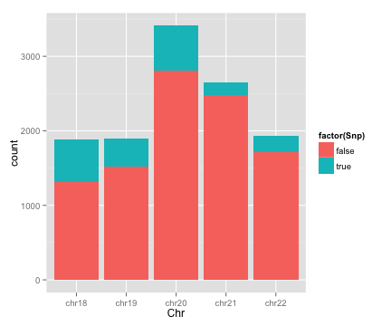
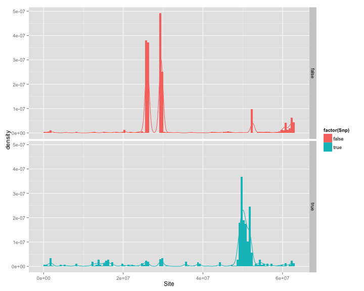

## 20150313 job

0. Watch the video of MultiGeMS
1. Check EM algorithm of R code
2. Check EM algorithm of C++ code
3. Select all suspicious sites from GiaB and Upenn datasets (unpooled)
4. Find some region from true SNPs according to properties (such as coverage, quality, etc.)
5. Find some special region according to properties

---

## Check EM algorithm (R)

- Use all the default value from GeMS-3gen-submax.R
- Process data from file "samples"
- Run multiEM function

---

## Code (Without paste of default values)

```
require("minqa")
require("Biostrings")
data <- read.table(file="samples", header=FALSE, sep="\t")
data <- cbind(data, data[,1])
data <- data[, 4:8]
data <- t(data)
source("em.R")
multiEM("C", data, c(1),1)
```

---

## Check EM algorithm (C++)

- Modify code to add debug function
- Modify code to add test function
- Run without parameter

---

## Create site file interest.txt

- Use upennmed.R (Comment pool part)
- Use gzip -d *.vcf.gz if necessary
- Use gzip -d *.out.gz if necessary
- Use cut -f 1-3 -d . multigemslist if necessary
- Use regions.rda
- Use intersect() setdiff()

---

## Select suspicious sites

```
zgrep -f ~/interest.txt *.pile.gz > ~/sites.txt
sort -n -k 2 sites.txt > sites.sorted.txt
```

completeness check

```
cat sites.sorted.txt | cut -f 2 | uniq | wc -l
cat interest.txt | wc -l
cat sites.sorted.txt | cut -c 3-7 | sort | uniq | wc -l
```

---

## Histgram

- The whole dataset
- Every Chromosome

---

## GiaB dataset


```r
library(ggplot2)
load("GiaB_dataset.rda")
p <- ggplot(data=GiaB_dataset, aes(x=Chr, fill=factor(Snp)))
p + geom_bar(position='fill')
```



---

## GiaB dataset (Code)


```r
library(ggplot2); 
load("GiaB_dataset.rda")
p <- ggplot(data=GiaB_dataset[GiaB_dataset$Chr=="chr19", ], aes(Site))
p + geom_histogram(binwidth=500000, position='identity', 
alpha=0.5, aes(y=..density.., fill=factor(Snp))) + 
stat_density(geom='line', position = 'identity', aes(colour = factor(Snp))) +
facet_grid(Snp~.)
```

---

## GiaB dataset (Chr18)


---

## GiaB dataset (Chr19)


---

## GiaB dataset (Chr20)


---

## GiaB dataset (Chr21)



---

## GiaB dataset (Chr22)


---

## Upenn dataset


```r
library(ggplot2)
load("upenn_dataset.rda")
p <- ggplot(data=upenn_dataset, aes(x=Chr, fill=factor(Snp)))
p + geom_bar(position='fill')
```


---

## Upenn dataset (Code)


```r
library(ggplot2); 
load("upenn_dataset.rda")
p <- ggplot(data=upenn_dataset[upenn_dataset$Chr=="chr19", ], aes(Site))
p + geom_histogram(binwidth=500000, position='identity', 
alpha=0.5, aes(y=..density.., fill=factor(Snp))) + 
stat_density(geom='line', position = 'identity', aes(colour = factor(Snp))) +
facet_grid(Snp~.)
```

---

## Upenn dataset (Chr19)


---

## Upenn dataset (Chr20)


---

## Upenn dataset (Chr21)


---

## Upenn dataset (Chr22)


---

## 20150313 learning

0. R basic manipulation
1. slidify
2. ggplot2
3. googleVis

---

## STUDYING

1. Least Angle Regression
2. Robust subspace clustering
3. A Survey of Clustering Data Mining Techniques
4. Sparse Recovery via Differential Inclusions
5. ROP: Matrix Recovery via Rank-one Projections
6. <font color='red'>ParticleCall</font>

---
