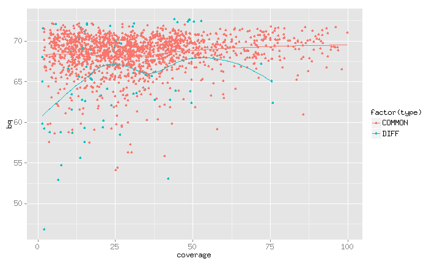
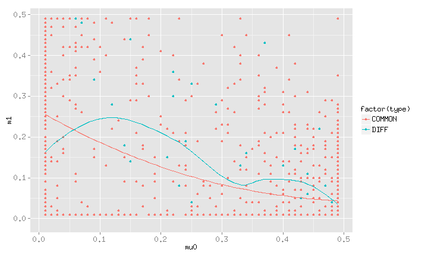
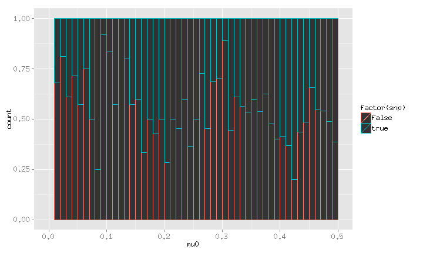

## GiaB 20 MQ SC HM

82.13 90.46 92.46

| Software | FREEBAY | GATK    | SAMTOOL | MULTIGE | VARSCAN |
| -------- | ------- | ------- | ------- | ------- | ------- |
| Region 1 | 0.34821 | 0.18329 | 0.48582 | 0.44252 | 0.44371 |
| Region 2 | 0.7564 | 0.49341 | 0.8509 | 0.85136 | 0.83011 |
| Region 3 | 0.97795 | 0.94855 | 0.98236 | 0.97623 | 0.97935 |
| Region 4 | 0.99034 | 0.98657 | 0.99169 | 0.98867 | 0.98982 |

---

## GiaB 21 MQ SW TPR

71.78 90.32 91.66

| Software | FREEBAY | GATK    | SAMTOOL | MULTIGE | VARSCAN |
| -------- | ------- | ------- | ------- | ------- | ------- |
| Region 1 | 0.76019 | 0.66037 | 0.8293 | 0.84347 | 0.79268 |
| Region 2 | 0.90647 | 0.77961 | 0.95246 | 0.6378 | 0.93 |
| Region 3 | 0.96554 | 0.93626 | 0.96845 | 0.92056 | 0.97832 |
| Region 4 | 0.98406 | 0.96864 | 0.97347 | 0.96737 | 0.98205 |

---

## GiaB 22 MQ SW TPR

71.345 89.69 91.345

| Software | FREEBAY | GATK    | SAMTOOL | MULTIGE | VARSCAN |
| -------- | ------- | ------- | ------- | ------- | ------- |
| Region 1 | 0.76976 | 0.68707 | 0.79169 | 0.8095 | 0.74418 |
| Region 2 | 0.9096 | 0.89599 | 0.95408 | 0.85569 | 0.94627 |
| Region 3 | 0.96895 | 0.96882 | 0.97899 | 0.95396 | 0.981 |
| Region 4 | 0.98506 | 0.97493 | 0.97711 | 0.97239 | 0.98454 |

---

## GiaB 22 MQ SW HM

68.915 84.83 88.915

| Software | FREEBAY | GATK    | SAMTOOL | MULTIGE | VARSCAN |
| -------- | ------- | ------- | ------- | ------- | ------- |
| Region 1 | 0.42985 | 0.32536 | 0.46759 | 0.50831 | 0.46694 |
| Region 2 | 0.4304 | 0.22919 | 0.60155 | 0.5781 | 0.5821 |
| Region 3 | 0.79038 | 0.53492 | 0.87326 | 0.84394 | 0.86132 |
| Region 4 | 0.96578 | 0.93274 | 0.97112 | 0.96783 | 0.97005 |

---

## MQ-BQ Relation

---

## Coverage-BQ Relation

---

## Coverage-MQ Relation

---

## Mu0-Mu1 Relation on TYPE

---

## Mu0-Mu1 Relation on SNP

---

## Mu0 with SNP

---

## Mu1 with SNP

---

## GiaB Coverage SW TPR

26.33 50.56 275.03

| Software | FREEBAY | GATK    | SAMTOOL | MULTIGE | VARSCAN |
| -------- | ------- | ------- | ------- | ------- | ------- |
| Region 1 | 0.77287 | 0.68525 | 0.78289 | 0.54985 | 0.74705 |
| Region 2 | 0.96377 | 0.9314 | 0.98553 | 0.92962 | 0.98111 |
| Region 3 | 0.9695 | 0.93487 | 0.99472 | 0.98428 | 0.98166 |
| Region 4 | 0.4596 | 0.48485 | 0.44949 | 0.41414 | 0.52525 |

---

## GiaB Coverage SW HM

28.415 54.73 277.315

| Software | FREEBAY | GATK    | SAMTOOL | MULTIGE | VARSCAN |
| -------- | ------- | ------- | ------- | ------- | ------- |
| Region 1 | 0.42985 | 0.24499 | 0.47907 | 0.47778 | 0.51342 |
| Region 2 | 0.91318 | 0.7754 | 0.95408 | 0.93414 | 0.94686 |
| Region 3 | 0.86365 | 0.73879 | 0.9016 | 0.90112 | 0.88358 |
| Region 4 | 0.04896 | 0.040985 | 0.052584 | 0.041057 | 0.057471 |

---

## GiaB Coverage SC PPV

46.5 50.9 55.1

| Software | FREEBAY | GATK    | SAMTOOL | MULTIGE | VARSCAN |
| -------- | ------- | ------- | ------- | ------- | ------- |
| Region 1 | 0.94096 | 0.91045 | 0.96492 | 0.88413 | 0.95967 |
| Region 2 | 0.97585 | 0.95581 | 0.99479 | 0.96196 | 0.9883 |
| Region 3 | 0.97916 | 0.9569 | 0.9916 | 0.96549 | 0.98634 |
| Region 4 | 0.95338 | 0.90025 | 0.99116 | 0.96291 | 0.9684 |

---

## GiaB Coverage SC HM

42.5 49.65 55.4

| Software | FREEBAY | GATK    | SAMTOOL | MULTIGE | VARSCAN |
| -------- | ------- | ------- | ------- | ------- | ------- |
| Region 1 | 0.67333 | 0.43264 | 0.77123 | 0.74463 | 0.78213 |
| Region 2 | 0.93259 | 0.81524 | 0.96316 | 0.94485 | 0.95648 |
| Region 3 | 0.9543 | 0.87436 | 0.9741 | 0.96226 | 0.96874 |
| Region 4 | 0.83844 | 0.70002 | 0.87953 | 0.86742 | 0.85846 |

---

## GiaB BQ SW TPR

57.3 68.94 71.135

| Software | FREEBAY | GATK    | SAMTOOL | MULTIGE | VARSCAN |
| -------- | ------- | ------- | ------- | ------- | ------- |
| Region 1 | 0.35963 | 0.34339 | 0.43619 | 0.1949 | 0.44316 |
| Region 2 | 0.95714 | 0.92258 | 0.98381 | 0.92746 | 0.97719 |
| Region 3 | 0.97516 | 0.94105 | 0.99055 | 0.96318 | 0.97956 |
| Region 4 | 0.9628 | 0.92361 | 0.98413 | 0.91075 | 0.96436 |

---

## GiaB BQ SW HM

54.405 67.35 70.59

| Software | FREEBAY | GATK    | SAMTOOL | MULTIGE | VARSCAN |
| -------- | ------- | ------- | ------- | ------- | ------- |
| Region 1 | 0.034286 | 0.025343 | 0.068697 | 0.051225 | 0.082645 |
| Region 2 | 0.71538 | 0.43441 | 0.85596 | 0.81693 | 0.84451 |
| Region 3 | 0.92526 | 0.85153 | 0.93987 | 0.92962 | 0.93408 |
| Region 4 | 0.88337 | 0.77673 | 0.90834 | 0.8932 | 0.89813 |

---

## GiaB BQ SC PPV

68.15 69.34 70.22

| Software | FREEBAY | GATK    | SAMTOOL | MULTIGE | VARSCAN |
| -------- | ------- | ------- | ------- | ------- | ------- |
| Region 1 | 0.94674 | 0.90818 | 0.97692 | 0.89922 | 0.97079 |
| Region 2 | 0.97295 | 0.95068 | 0.99044 | 0.96162 | 0.98407 |
| Region 3 | 0.97568 | 0.94726 | 0.99037 | 0.96625 | 0.98086 |
| Region 4 | 0.97145 | 0.92937 | 0.98958 | 0.95275 | 0.97448 |

---

## GiaB BQ SC HM

66.01 68.79 70.06

| Software | FREEBAY | GATK    | SAMTOOL | MULTIGE | VARSCAN |
| -------- | ------- | ------- | ------- | ------- | ------- |
| Region 1 | 0.55784 | 0.27305 | 0.77585 | 0.72387 | 0.76198 |
| Region 2 | 0.91225 | 0.81547 | 0.9321 | 0.91572 | 0.92818 |
| Region 3 | 0.92908 | 0.86131 | 0.9428 | 0.93405 | 0.93765 |
| Region 4 | 0.90161 | 0.80924 | 0.92193 | 0.90967 | 0.91179 |

---

## GiaB MQ SW TPR

71.69 90.38 91.69

| Software | FREEBAY | GATK    | SAMTOOL | MULTIGE | VARSCAN |
| -------- | ------- | ------- | ------- | ------- | ------- |
| Region 1 | 0.80194 | 0.67649 | 0.84936 | 0.81686 | 0.80764 |
| Region 2 | 0.91494 | 0.84466 | 0.96082 | 0.83376 | 0.94986 |
| Region 3 | 0.9703 | 0.95302 | 0.9724 | 0.94654 | 0.97818 |
| Region 4 | 0.98513 | 0.97193 | 0.97539 | 0.97173 | 0.98289 |

---

## GiaB MQ SW HM

69.46 85.92 89.46

| Software | FREEBAY | GATK    | SAMTOOL | MULTIGE | VARSCAN |
| -------- | ------- | ------- | ------- | ------- | ------- |
| Region 1 | 0.4362 | 0.29069 | 0.48735 | 0.49534 | 0.48233 |
| Region 2 | 0.46265 | 0.2447 | 0.62348 | 0.5602 | 0.59205 |
| Region 3 | 0.83107 | 0.60107 | 0.88526 | 0.86229 | 0.87573 |
| Region 4 | 0.97628 | 0.94943 | 0.98029 | 0.97566 | 0.97824 |

---

## GiaB MQ SC PPV

90.8 92.3 92.6

| Software | FREEBAY | GATK    | SAMTOOL | MULTIGE | VARSCAN |
| -------- | ------- | ------- | ------- | ------- | ------- |
| Region 1 | 0.912 | 0.84883 | 0.95485 | 0.84459 | 0.94172 |
| Region 2 | 0.97598 | 0.95689 | 0.9671 | 0.95345 | 0.9773 |
| Region 3 | 0.98491 | 0.97193 | 0.97451 | 0.97188 | 0.98261 |
| Region 4 | 0.98991 | 0.98078 | 0.98227 | 0.98115 | 0.98774 |

---

## GiaB MQ SC HM

81.51 89.82 92.41

| Software | FREEBAY | GATK    | SAMTOOL | MULTIGE | VARSCAN |
| -------- | ------- | ------- | ------- | ------- | ------- |
| Region 1 | 0.40583 | 0.2307 | 0.52473 | 0.48449 | 0.50323 |
| Region 2 | 0.74357 | 0.47882 | 0.83908 | 0.80485 | 0.8239 |
| Region 3 | 0.96647 | 0.92328 | 0.97287 | 0.96595 | 0.9708 |
| Region 4 | 0.9875 | 0.98262 | 0.98862 | 0.98676 | 0.98659 |

---

